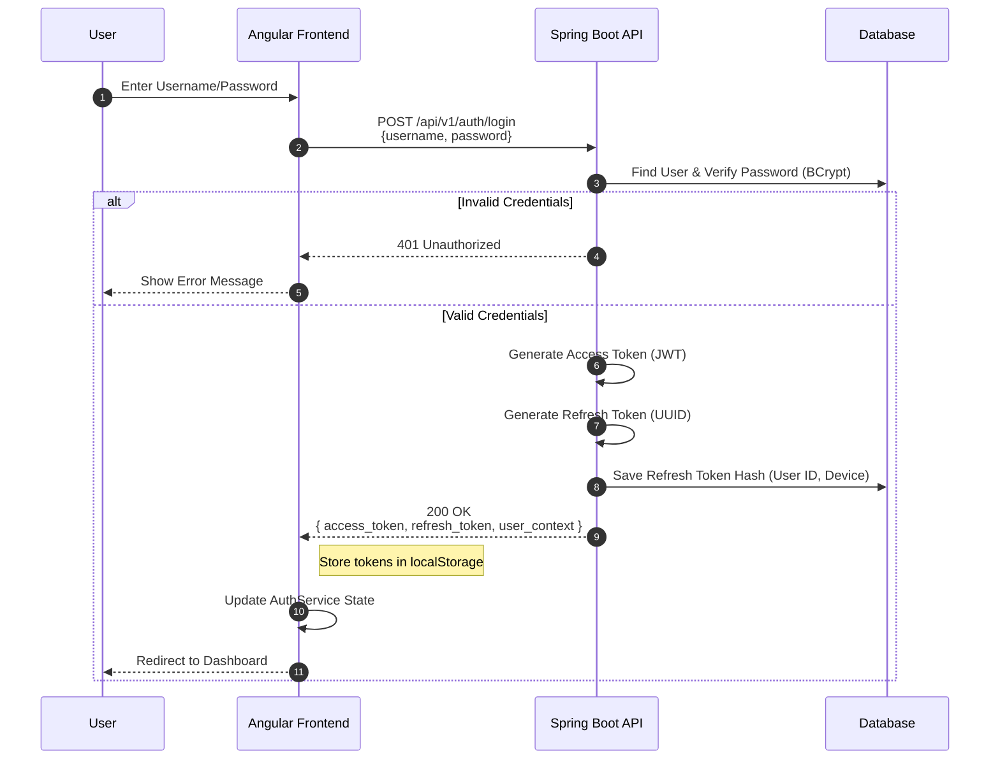
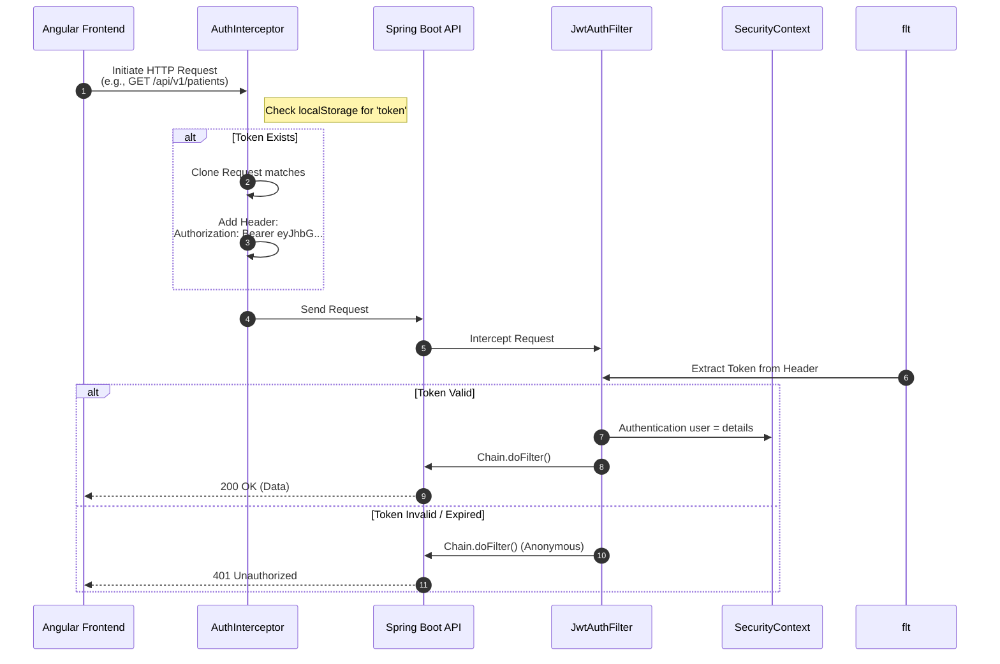
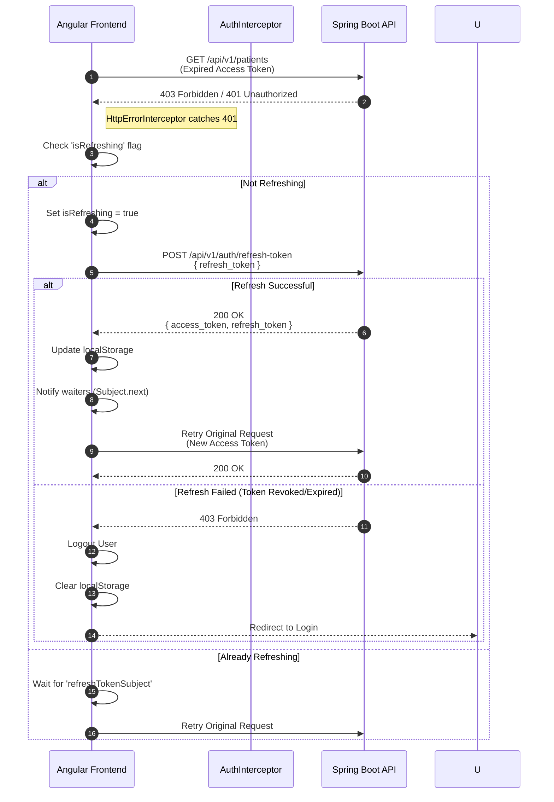

# Authentication & Security Flow

This document details the **JWT-based authentication flow** and **CSRF strategy** for the Hospital Management System (HMS), bridging the Angular Frontend and Spring Boot Backend.

## 1. Security Architecture Overview

- **Pattern**: Stateless Authentication using JSON Web Tokens (JWT).
- **Storage**: Tokens are stored in the Client (Frontend).
  - *Access Token*: `localStorage` (Short-lived, e.g., 15 mins).
  - *Refresh Token*: `localStorage` (Long-lived, e.g., 7 days) & Database (Hashed).
- **Transport**: Protected via HTTPS (Production) and `Authorization: Bearer <token>` header.
- **CSRF**: **Disabled**.
  - *Reasoning*: The application uses **Bearer Tokens** in headers, not cookies. Browsers do not automatically attach auth headers like they do with cookies, making standard CSRF attacks impossible.

---

## 2. Login Flow

The user provides credentials, and the server validates them, returning a pair of tokens.

---

## 3. Authenticated Request Flow

For every subsequent request, the Frontend automatically attaches the Access Token.

---

## 4. Refresh Token Flow (Handling 401)

When the Access Token expires, the Frontend must silently refresh it using the Refresh Token.

---

## 5. CSRF (Cross-Site Request Forgery)

### Why is it disabled?
CSRF attacks rely on the browser's behavior of automatically sending cookies (like `JSESSIONID`) with cross-origin requests.

1.  **Cookie-Based Auth**: Protocol `POST http://bank.com/transfer` -> Browser sends `Cookie: session_id=123`. Malicious site can trigger this. **Requires CSRF Token**.
2.  **Token-Based Auth (Our Approach)**: Protocol `POST http://api.hms/patients` -> Code must explicitly set `Authorization: Bearer <token>`.
    *   A malicious site cannot force your browser to read `localStorage` and attach the specific header.
    *   Therefore, **CSRF protection is not required** for this architecture.

### Security Trade-off
*   **Risk**: If we stored the JWT in an `HttpOnly` cookie (to prevent XSS), we *would* generally need CSRF protection (specifically SameSite=Strict helps, but CSRF tokens are safer).
*   **Current Choice**: Storing in `localStorage` makes the token accessible to JavaScript.
    *   **Vulnerability**: XSS (Cross-Site Scripting). If an attacker injects a script, they can steal the token.
    *   **Mitigation**: Strict Input Validation, Output Encoding, and Content Security Policy (CSP).

---

## 6. Implementation Checklist

### Backend
- [ ] Ensure `SecurityConfig` disables CSRF: `.csrf(csrf -> csrf.disable())`.
- [ ] Ensure `CorsConfiguration` allows headers: `Authorization`, `Content-Type`.
- [ ] Implement `JwtFilter` to parse `Bearer ` string.

### Frontend
- [ ] `AuthInterceptor` must handle adding the header.
- [ ] `ErrorInterceptor` must handle 401 loop for Refresh Token logic (currently missing in v3).
