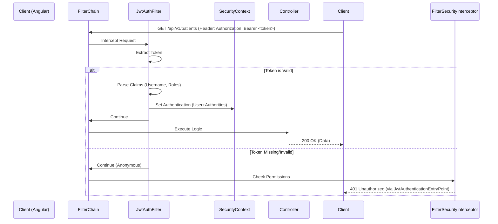

# Authentication & Request Flow

This document details how a user authenticates with the system and how subsequent requests are validated.

## 1. Login Flow (Conceptual)

Since the `AuthController` is the next step in implementation, this describes the standard flow we are building towards.

1.  **Frontend Request**:
    *   User enters username/password on the Login Page.
    *   Angular sends `POST /api/v1/auth/login` with `{ username, password }`.

2.  **Backend Processing (`AuthController`)**:
    *   `AuthenticationManager` authenticates the credentials.
    *   It uses `DaoAuthenticationProvider` backed by our `CustomUserDetailsService`.
    *   `CustomUserDetailsService` fetches the user from MySQL and verifies the BCrypt hash.

3.  **Token Generation**:
    *   If valid, the server generates a **JWT (Access Token)** signed with a secret key.
    *   Optionally generates a Refresh Token (long-lived).

4.  **Response**:
    *   Server returns `200 OK` with `{ accessToken, refreshToken, userDetails }`.

## 2. Authenticated Request Flow

Once the user has a token, every request to a protected resource (e.g., `/api/v1/patients`) follows this path:

## 3. Component Interaction

### The "401" Scenario (Unauthenticated)
1.  User requests `/api/v1/test` without a token.
2.  `JwtAuthenticationFilter` sees no token, passes request down.
3.  Spring Security's authorization filter checks configuration: `.anyRequest().authenticated()`.
4.  It sees the user is Anonymous (not authenticated).
5.  It throws an `AuthenticationException`.
6.  **`JwtAuthenticationEntryPoint`** catches this exception.
7.  It writes a custom JSON response: `{ "error": "Unauthorized", ... }`.

### The "403" Scenario (Unauthorized)
1.  User (e.g., Nurse) requests `/api/v1/admin/users`.
2.  `JwtAuthenticationFilter` validates token, sets User in Context.
3.  Spring Security checks permissions (e.g., `@PreAuthorize("hasRole('ADMIN')")`).
4.  It sees the user only has `ROLE_NURSE`.
5.  It throws an `AccessDeniedException`.
6.  **`CustomAccessDeniedHandler`** catches this exception.
7.  It writes a custom JSON response: `{ "error": "Forbidden", ... }`.
