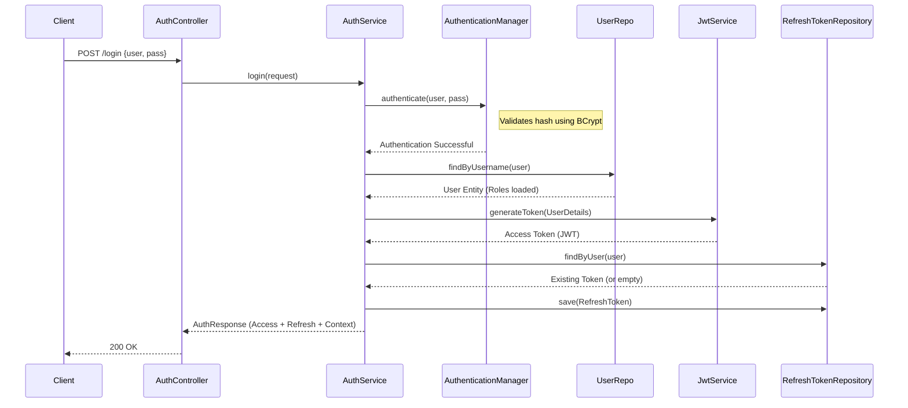
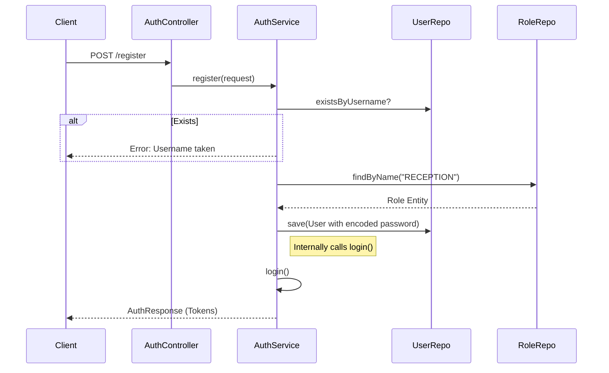
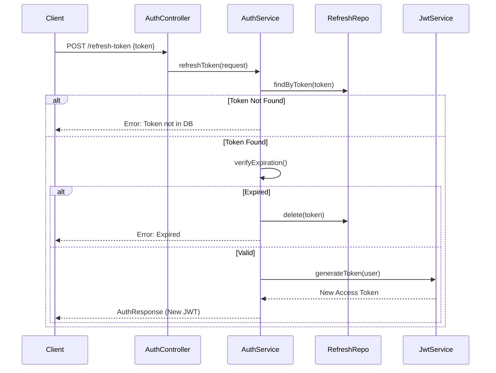
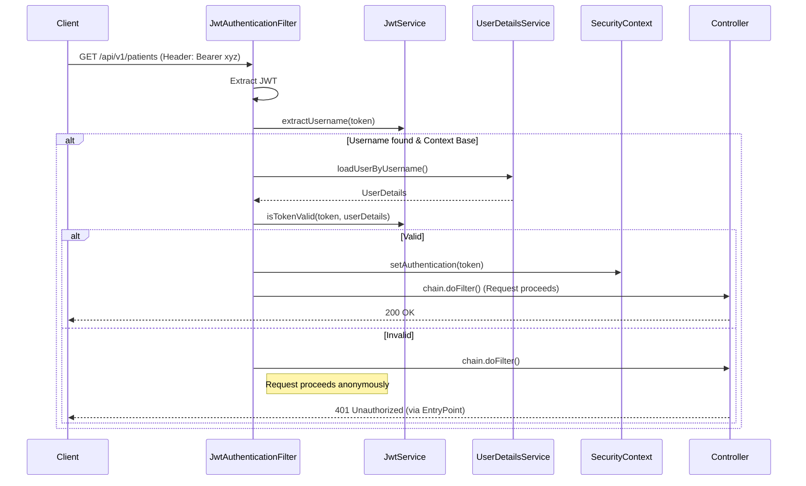
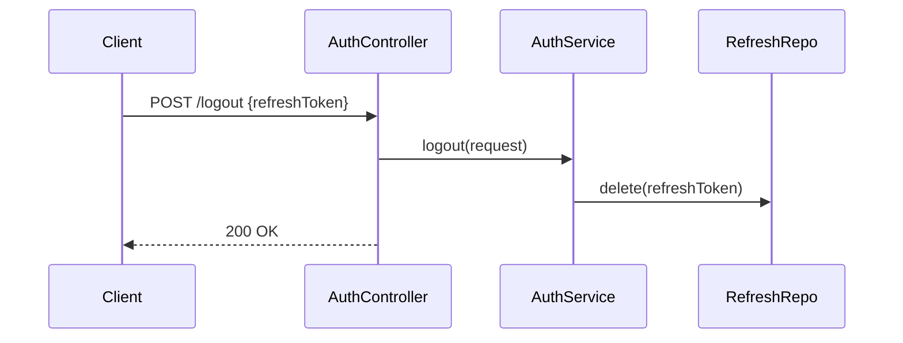

# Authentication API Flow & Architecture

This document provides a visual and technical overview of how the Authentication system works in the HMS Backend.

## 1. System Architecture

The security module is built on **Spring Security 6** and uses **Stateless JWT Authentication**.

### Key Components

| Component | Responsibility |
| :--- | :--- |
| **SecurityConfig** | Main configuration. Disables CSRF, sets stateless session, configures CORS, and registers the JWT Filter. |
| **JwtAuthenticationFilter** | Intercepts *every* request. Checks for `Authorization: Bearer <token>`. Validates token and sets User in Context. |
| **AuthService** | Business logic for Login, Register, Refresh, and Logout. Transactional. |
| **JwtService** | Low-level JWT operations: Signing, Validating, Extracting Claims. |
| **CustomUserDetailsService** | Loads user data (Password, Authorities) from the DB for Spring Security. |
| **DataInitializer** | Seeds the database with default Roles (`ADMIN`, `DOCTOR`, etc.) and Permissions on startup. |

---

## 2. Authentication Flows

### A. Login Flow (`POST /api/v1/auth/login`)

The user exchanges credentials (username/password) for an Access Token and a Refresh Token.



### B. Registration Flow (`POST /api/v1/auth/register`)

Registers a new user and immediately logs them in.



### C. Token Refresh Flow (`POST /api/v1/auth/refresh-token`)

Used when the Access Token expires. The client sends the long-lived user-specific Refresh Token to get a new Access Token.



### D. Protected Request Flow (Any secured endpoint)

How the system validates requests to endpoints like `/api/v1/patients`.



### E. Logout Flow (`POST /api/v1/auth/logout`)

Revokes the Refresh Token so it cannot be used to generate new Access Tokens.



---

## 3. Key Configuration Files

### `SecurityConfig.java`
Controls the entire security filter chain.
```java
@Bean
public SecurityFilterChain securityFilterChain(HttpSecurity http) throws Exception {
    http
        .csrf(AbstractHttpConfigurer::disable)
        .authorizeHttpRequests(auth -> auth
            .requestMatchers("/api/v1/auth/**").permitAll() // Open generic auth endpoints
            .anyRequest().authenticated() // Lock everything else
        )
        .sessionManagement(...) // Stateless
        .authenticationProvider(authenticationProvider)
        .addFilterBefore(jwtAuthFilter, UsernamePasswordAuthenticationFilter.class); // Inject our filter
    return http.build();
}
```

### `JwtService.java`
Handles the math of encryption.
- **Access Token**: Short life (30 min). Contains Claims (Subject, IssuedAt, Exp).
- **Secret Key**: `HmacSHA256` key defined in `application.properties`.

### `RefreshToken.java`
Persists the session.
- Allows us to "Kill" a session by deleting this row from the DB.
- If we only used JWTs, we couldn't invalidate them before expiry (without a blacklist).
