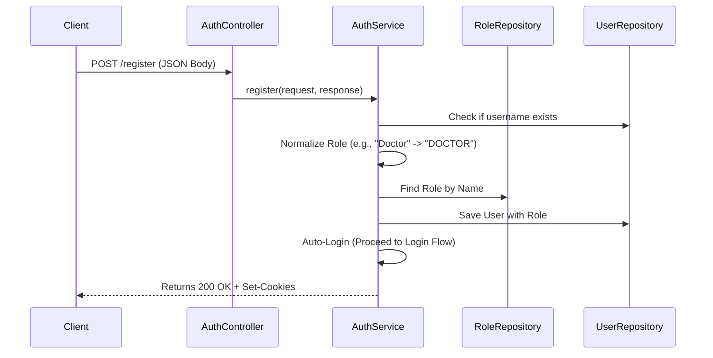
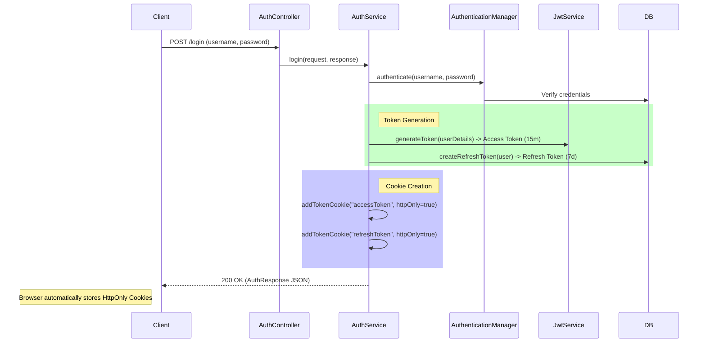
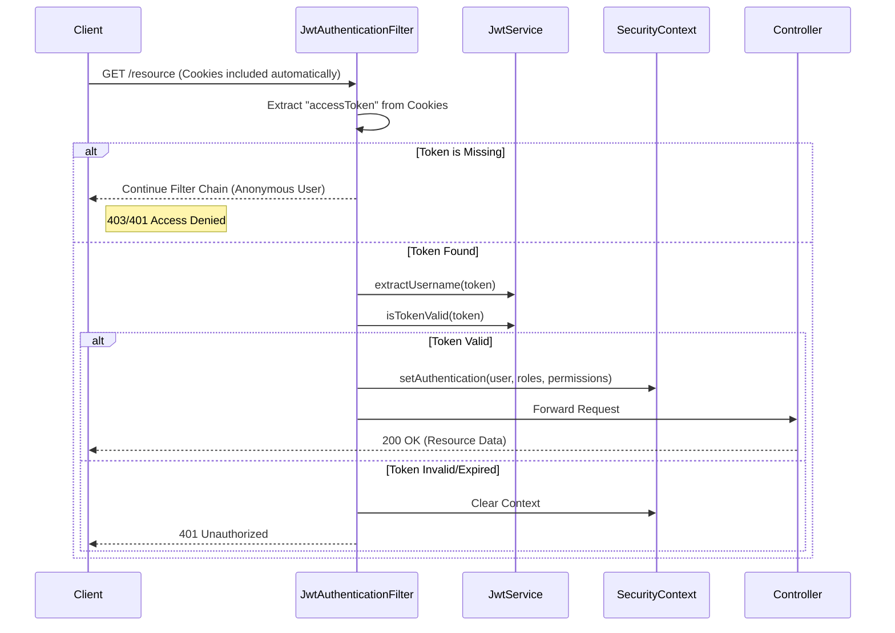
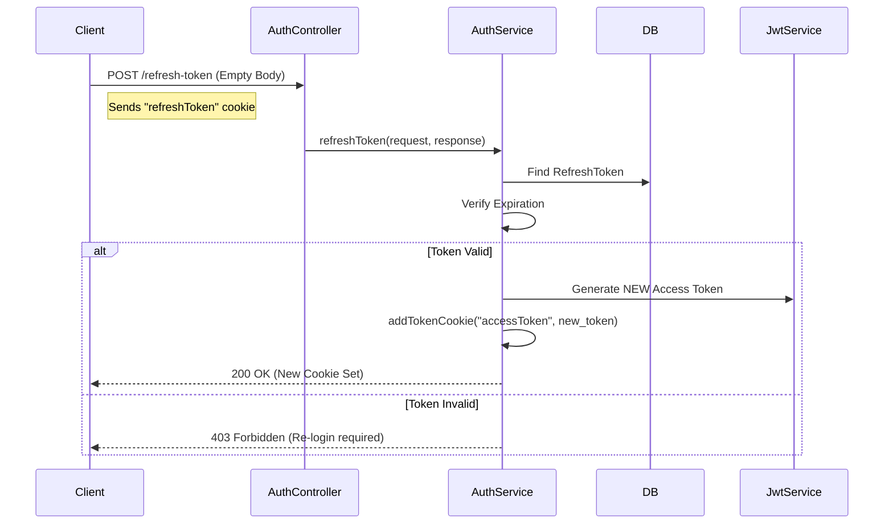
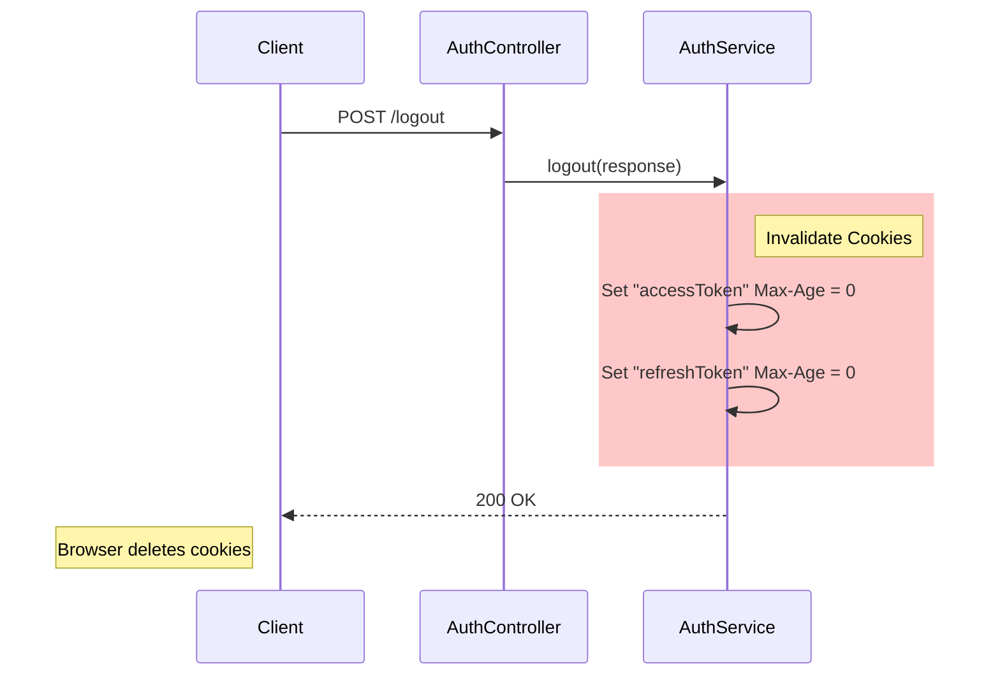

# Comprehensive Authentication Flow Guide (Deep Dive)

This document provides a detailed explanation of the **Cookie-based JWT Authentication System** implemented in the Hospital Management System (HMS) backend. It covers the entire lifecycle of a request, from registration to accessing protected resources, including architectural decisions and security measures.

## 1. Architecture Overview

The system uses a **Stateless** authentication model where the server does not store user sessions in memory. Instead, it relies on **JSON Web Tokens (JWT)** stored in **HttpOnly Cookies** on the client side.

### Key Technologies
*   **Spring Security 6**: The core framework handling authentication and authorization.
*   **JWT (JJWT)**: Used to create signed tokens containing user identity and expiration.
*   **HttpOnly Cookies**: Secure storage mechanism to prevent Cross-Site Scripting (XSS) attacks.
*   **RBAC (Role-Based Access Control)**: Database-driven permission system (`User` -> `Role` -> `Permission`).

---

## 2. Core Components

| Component | Responsibility |
| :--- | :--- |
| **`SecurityConfig`** | The "gatekeeper". Configures the filter chain, CORS, CSRF (disabled), and session management (Stateless). |
| **`JwtAuthenticationFilter`** | Intercepts *every* request. Checks for `accessToken` cookie, validates it, and sets the Security Context. |
| **`AuthService`** | Business logic for Register, Login, Refresh, and Logout operations. Handles cookie creation. |
| **`CustomUserDetailsService`** | Loads specific user data (including roles/permissions) from the database efficiently. |
| **`JwtService`** | Utility class for generating, signing, and extracting data from JWT tokens. |

---

## 3. Data Model (RBAC)

The security model is built on three main entities:

1.  **User**: The person logging in (e.g., `admin`).
2.  **Role**: A grouping of permissions (e.g., `DOCTOR`, `RECEPTION`).
3.  **Permission**: Granular access rights (e.g., `MOD_PATIENTS`, `ACT_VIEW`).

**Relationship**: `User` *Has-Many* `Roles` *Has-Many* `Permissions`.
*(Note: Current implementation simplifies this by assigning one main Role per user effectively, but the database supports multiple)*.

---

## 4. Authentication Flows

### A. Registration Flow (Simplified)

When a new user signs up, the system automatically assigns them a role and logs them in.



---

### B. Login Flow (The core logic)

This is where the cookies are generated.



**Key Code Insight (`AuthService.login`):**
```java
// Sets the HTTP Response Cookies directly
addTokenCookie(response, "accessToken", accessToken, 15 * 60); 
addTokenCookie(response, "refreshToken", refreshToken, 7 * 24 * 60 * 60);
```

---

### C. Protected Request Flow (Validation)

How the backend knows who you are for subsequent requests (e.g., `GET /api/v1/patients`).



---

### D. Token Refresh Flow

When the `accessToken` (15 mins) expires, the client uses the `refreshToken` (7 days) to get a new one silently.



---

### E. Logout Flow

Clearing the session.



---

## 5. Security Details

### Why HttpOnly Cookies?
Storing JWTs in `localStorage` behaves like saving your house key under the doormat. Any JavaScript code (including malicious scripts injected via XSS) can read it.
**HttpOnly Cookies** cannot be accessed by JavaScript (`document.cookie` returns nothing). They are only sent automatically by the browser to the server.

### Permissions in `AuthResponse`
While the tokens are hidden in cookies, the frontend still needs to know *what* the user can do (e.g., "Can I see the 'Delete Patient' button?").
The `AuthResponse` DTO provides this **safe** information:

```json
{
    "username": "doctor_strange",
    "role": "DOCTOR",
    "permissions": ["MOD_PATIENTS", "ACT_VIEW", "CMP_VITALS_WRITE"]
}
```
The Frontend uses this JSON to toggle UI elements, while the Backend uses the Cookie to enforce security.

### Eager Fetching (`Role.java`)
We use `@ManyToMany(fetch = FetchType.EAGER)` for permissions. This ensures that when we load a User, we immediately have their full security profile loaded in memory, preventing `LazyInitializationException` errors during the critical authentication phase.
