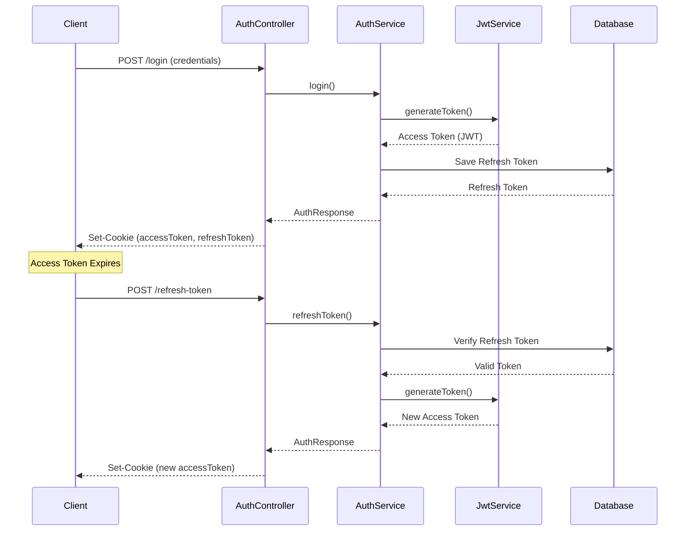

# Access and Refresh Tokens

This document provides a comprehensive guide to the **Access Token** and **Refresh Token** implementation in the Hospital Management System (HMS).

## 1. Overview

The HMS uses a **dual-token authentication system**:
- **Access Token (JWT)**: Short-lived token for API authentication
- **Refresh Token**: Long-lived token for obtaining new access tokens

### Token Flow Diagram



---

## 2. Access Token (JWT)

### 2.1 What is an Access Token?

An **Access Token** is a **JSON Web Token (JWT)** that contains:
- User identity (username)
- Expiration time
- Digital signature for verification

### 2.2 Access Token Structure

```
eyJhbGciOiJIUzI1NiIsInR5cCI6IkpXVCJ9.eyJzdWIiOiJhZG1pbiIsImlhdCI6MTcwNzU2NjQwMCwiZXhwIjoxNzA3NTY3MzAwfQ.signature
```

**Decoded Payload**:
```json
{
  "sub": "admin",
  "iat": 1707566400,
  "exp": 1707567300
}
```

| Field | Description |
|-------|-------------|
| `sub` | Subject (username) |
| `iat` | Issued at timestamp |
| `exp` | Expiration timestamp |

### 2.3 Access Token Configuration

**File**: `application.properties`

```properties
# Access token expiration: 15 minutes (900,000 milliseconds)
jwt.expiration=900000

# JWT secret key (Base64 encoded, minimum 256 bits)
jwt.secret=VGhpc0lzQVNlY3JldEtleVGhhdElzTG9uZ0Vub3VnaEZvckhTMjU2QWxnb3JpdGht
```

### 2.4 Access Token Generation

**Service**: `JwtService.java`

```java
public String generateToken(UserDetails userDetails) {
    return Jwts.builder()
            .setSubject(userDetails.getUsername())
            .setIssuedAt(new Date(System.currentTimeMillis()))
            .setExpiration(new Date(System.currentTimeMillis() + jwtExpiration))
            .signWith(getSignInKey(), SignatureAlgorithm.HS256)
            .compact();
}
```

**Key Points**:
- Algorithm: **HS256** (HMAC with SHA-256)
- Expiration: **15 minutes** (configurable)
- Signed with secret key for integrity verification

### 2.5 Access Token Validation

**Service**: `JwtService.java`

```java
public boolean isTokenValid(String token, UserDetails userDetails) {
    final String username = extractUsername(token);
    return (username.equals(userDetails.getUsername())) && !isTokenExpired(token);
}

private boolean isTokenExpired(String token) {
    return extractExpiration(token).before(new Date());
}
```

**Validation Steps**:
1. Extract username from token
2. Verify username matches authenticated user
3. Check token is not expired

### 2.6 Access Token Usage

**Filter**: `JwtAuthenticationFilter.java`

The access token is extracted from:
1. **HTTP-only Cookie** (named `accessToken`)
2. **Authorization Header** (format: `Bearer <token>`)

```java
// Extract from cookie
String token = extractTokenFromCookie(request);

// Or extract from Authorization header
String authHeader = request.getHeader("Authorization");
if (authHeader != null && authHeader.startsWith("Bearer ")) {
    token = authHeader.substring(7);
}
```

---

## 3. Refresh Token

### 3.1 What is a Refresh Token?

A **Refresh Token** is a **long-lived, opaque token** stored in the database that allows clients to obtain new access tokens without re-authenticating.

### 3.2 Refresh Token Entity

**Entity**: `RefreshToken.java`

```java
@Entity
@Table(name = "refresh_tokens")
public class RefreshToken {
    @Id
    @GeneratedValue(strategy = GenerationType.IDENTITY)
    private Long id;

    @Column(nullable = false, unique = true)
    private String token;  // UUID

    @OneToOne
    @JoinColumn(name = "user_id", referencedColumnName = "id")
    private User user;

    @Column(nullable = false)
    private Instant expiryDate;
}
```

### 3.3 Refresh Token Configuration

**File**: `application.properties`

```properties
# Refresh token expiration: 7 days (604,800,000 milliseconds)
jwt.refresh-expiration=604800000

# Secure cookie setting (set to true in production with HTTPS)
app.security.secure-cookie=false
```

### 3.4 Refresh Token Generation

**Service**: `AuthService.java`

```java
public RefreshToken createRefreshToken(User user) {
    // Find existing refresh token or create new one
    RefreshToken refreshToken = refreshTokenRepository.findByUser(user)
            .orElse(new RefreshToken());

    refreshToken.setUser(user);
    refreshToken.setExpiryDate(Instant.now().plusMillis(refreshExpiration));
    refreshToken.setToken(UUID.randomUUID().toString());

    return refreshTokenRepository.save(refreshToken);
}
```

**Key Points**:
- **One refresh token per user** (replaces existing token)
- Token value: **UUID** (random, unique identifier)
- Expiration: **7 days** (configurable)
- Stored in **database** for validation

### 3.5 Refresh Token Validation

**Service**: `AuthService.java`

```java
public RefreshToken verifyExpiration(RefreshToken token) {
    if (token.getExpiryDate().compareTo(Instant.now()) < 0) {
        refreshTokenRepository.delete(token);
        throw new RuntimeException("Refresh token was expired. Please make a new signin request");
    }
    return token;
}
```

**Validation Steps**:
1. Check if token exists in database
2. Verify token is not expired
3. Delete expired tokens automatically

---

## 4. Authentication Flow

### 4.1 Login Flow

**Endpoint**: `POST /api/v1/auth/login`

```bash
curl -X POST http://localhost:8080/api/v1/auth/login \
  -H "Content-Type: application/json" \
  -d '{
    "username": "admin",
    "password": "admin123"
  }'
```

**Process**:
1. Client sends credentials
2. Server authenticates user
3. Server generates **access token** (JWT)
4. Server creates **refresh token** (UUID, stored in DB)
5. Server sets **HTTP-only cookies** with both tokens
6. Server returns user info and permissions

**Response**:
```json
{
  "username": "admin",
  "role": "ADMIN",
  "permissions": ["CMP_PATIENT_READ", "CMP_PATIENT_WRITE", ...]
}
```

**Cookies Set**:
```
Set-Cookie: accessToken=<jwt>; HttpOnly; Path=/; Max-Age=900; SameSite=Lax
Set-Cookie: refreshToken=<uuid>; HttpOnly; Path=/; Max-Age=604800; SameSite=Lax
```

### 4.2 API Request with Access Token

**Endpoint**: `GET /api/v1/patients`

```bash
curl -X GET http://localhost:8080/api/v1/patients \
  -H "Authorization: Bearer <access-token>"
```

**Process**:
1. Client sends request with access token (cookie or header)
2. `JwtAuthenticationFilter` intercepts request
3. Filter validates access token
4. Filter sets `SecurityContext` with user details
5. Controller executes with authenticated user
6. Response returned to client

### 4.3 Refresh Token Flow

**Endpoint**: `POST /api/v1/auth/refresh-token`

```bash
# Option 1: Refresh token in cookie (automatic)
curl -X POST http://localhost:8080/api/v1/auth/refresh-token \
  --cookie "refreshToken=<refresh-token>"

# Option 2: Refresh token in request body
curl -X POST http://localhost:8080/api/v1/auth/refresh-token \
  -H "Content-Type: application/json" \
  -d '{
    "refreshToken": "<refresh-token>"
  }'
```

**Process**:
1. Client sends refresh token (cookie or body)
2. Server validates refresh token from database
3. Server verifies token is not expired
4. Server generates **new access token**
5. Server sets new access token cookie
6. Server returns user info

**Response**:
```json
{
  "username": "admin",
  "role": "ADMIN",
  "permissions": ["CMP_PATIENT_READ", "CMP_PATIENT_WRITE", ...]
}
```

**New Cookie Set**:
```
Set-Cookie: accessToken=<new-jwt>; HttpOnly; Path=/; Max-Age=900; SameSite=Lax
```

### 4.4 Logout Flow

**Endpoint**: `POST /api/v1/auth/logout`

```bash
curl -X POST http://localhost:8080/api/v1/auth/logout
```

**Process**:
1. Client sends logout request
2. Server clears both token cookies (sets Max-Age=0)
3. Client should discard tokens

**Cookies Cleared**:
```
Set-Cookie: accessToken=; HttpOnly; Path=/; Max-Age=0
Set-Cookie: refreshToken=; HttpOnly; Path=/; Max-Age=0
```

---

## 5. Token Storage

### 5.1 Cookie-Based Storage (Recommended)

**Advantages**:
- ✅ **HTTP-only**: Not accessible via JavaScript (XSS protection)
- ✅ **Secure**: Transmitted only over HTTPS (in production)
- ✅ **SameSite**: CSRF protection
- ✅ **Automatic**: Browser sends cookies automatically

**Configuration**:
```java
ResponseCookie cookie = ResponseCookie.from(name, value)
        .httpOnly(true)           // Prevent JavaScript access
        .secure(secureCookie)     // HTTPS only (production)
        .path("/")                // Available for all paths
        .maxAge(maxAge)           // Expiration time
        .sameSite("Lax")          // CSRF protection
        .build();
```

### 5.2 Header-Based Storage (Alternative)

**Advantages**:
- ✅ Works with mobile apps and non-browser clients
- ✅ More control over token lifecycle

**Disadvantages**:
- ❌ Requires manual token management
- ❌ Vulnerable to XSS if stored in localStorage

**Usage**:
```bash
curl -X GET http://localhost:8080/api/v1/patients \
  -H "Authorization: Bearer <access-token>"
```

---

## 6. Database Schema

### 6.1 refresh_tokens Table

```sql
CREATE TABLE refresh_tokens (
    id BIGINT AUTO_INCREMENT PRIMARY KEY,
    token VARCHAR(255) NOT NULL UNIQUE,
    user_id BIGINT NOT NULL,
    expiry_date TIMESTAMP NOT NULL,
    FOREIGN KEY (user_id) REFERENCES users(id) ON DELETE CASCADE
);
```

### 6.2 Token Lifecycle

```
┌─────────────────────────────────────────────────────────┐
│                    User Login                            │
└────────────────────┬────────────────────────────────────┘
                     │
                     ▼
┌─────────────────────────────────────────────────────────┐
│         Create/Update Refresh Token in DB                │
│  - Generate UUID                                         │
│  - Set expiry date (now + 7 days)                        │
│  - Link to user                                          │
│  - Save to database                                      │
└────────────────────┬────────────────────────────────────┘
                     │
                     ▼
┌─────────────────────────────────────────────────────────┐
│              Token Active (7 days)                       │
│  - Can be used to refresh access token                   │
│  - Stored in database                                    │
└────────────────────┬────────────────────────────────────┘
                     │
                     ▼
┌─────────────────────────────────────────────────────────┐
│              Token Expiration                            │
│  - Automatically deleted on verification                 │
│  - User must login again                                 │
└─────────────────────────────────────────────────────────┘
```

---

## 7. Security Best Practices

### 7.1 Access Token Security

1. **Short Expiration**: 15 minutes reduces exposure window
2. **HTTPS Only**: Always use HTTPS in production
3. **Signature Verification**: Validates token integrity
4. **No Sensitive Data**: Don't store sensitive info in JWT payload

### 7.2 Refresh Token Security

1. **Database Storage**: Allows server-side revocation
2. **One Token Per User**: Replaces old token on login
3. **Expiration Validation**: Automatic cleanup of expired tokens
4. **HTTP-only Cookie**: Prevents JavaScript access

### 7.3 Production Configuration

**File**: `application-prod.properties`

```properties
# Use strong, randomly generated secret (minimum 256 bits)
jwt.secret=${JWT_SECRET}

# Enable secure cookies (HTTPS only)
app.security.secure-cookie=true

# Adjust expiration times as needed
jwt.expiration=900000          # 15 minutes
jwt.refresh-expiration=604800000  # 7 days
```

### 7.4 Secret Key Management

> [!CAUTION]
> **Never commit secrets to version control!**

**Best Practices**:
- Use environment variables for secrets
- Rotate secrets periodically
- Use different secrets for dev/staging/production
- Minimum 256-bit key for HS256 algorithm

**Generate Secret Key**:
```bash
# Generate random 256-bit key and encode to Base64
openssl rand -base64 32
```

---

## 8. Error Handling

### 8.1 Access Token Errors

| Error | Status | Description | Solution |
|-------|--------|-------------|----------|
| Token Missing | 401 | No token provided | Include token in request |
| Token Expired | 401 | Access token expired | Use refresh token to get new access token |
| Invalid Signature | 401 | Token tampered or wrong secret | Re-authenticate |
| Invalid Format | 401 | Malformed JWT | Check token format |

### 8.2 Refresh Token Errors

| Error | Status | Description | Solution |
|-------|--------|-------------|----------|
| Token Missing | 400 | No refresh token provided | Include refresh token |
| Token Expired | 401 | Refresh token expired | Login again |
| Token Not Found | 401 | Token not in database | Login again |
| Token Invalid | 401 | Token format invalid | Login again |

### 8.3 Error Response Format

```json
{
  "timestamp": "2026-02-11T10:30:45.123Z",
  "status": 401,
  "error": "Unauthorized",
  "message": "Refresh token was expired. Please make a new signin request",
  "path": "/api/v1/auth/refresh-token"
}
```

---

## 9. Client Implementation Examples

### 9.1 Angular/TypeScript

```typescript
// auth.service.ts
import { Injectable } from '@angular/core';
import { HttpClient } from '@angular/common/http';

@Injectable({ providedIn: 'root' })
export class AuthService {
  private baseUrl = 'http://localhost:8080/api/v1/auth';

  constructor(private http: HttpClient) {}

  login(username: string, password: string) {
    return this.http.post(`${this.baseUrl}/login`, 
      { username, password },
      { withCredentials: true }  // Include cookies
    );
  }

  refreshToken() {
    return this.http.post(`${this.baseUrl}/refresh-token`, {},
      { withCredentials: true }  // Send refresh token cookie
    );
  }

  logout() {
    return this.http.post(`${this.baseUrl}/logout`, {},
      { withCredentials: true }
    );
  }
}
```

**HTTP Interceptor** (Auto-refresh on 401):
```typescript
// auth.interceptor.ts
import { Injectable } from '@angular/core';
import { HttpInterceptor, HttpRequest, HttpHandler, HttpErrorResponse } from '@angular/common/http';
import { catchError, switchMap } from 'rxjs/operators';
import { throwError } from 'rxjs';

@Injectable()
export class AuthInterceptor implements HttpInterceptor {
  constructor(private authService: AuthService) {}

  intercept(req: HttpRequest<any>, next: HttpHandler) {
    return next.handle(req).pipe(
      catchError((error: HttpErrorResponse) => {
        if (error.status === 401 && !req.url.includes('/refresh-token')) {
          // Access token expired, try to refresh
          return this.authService.refreshToken().pipe(
            switchMap(() => {
              // Retry original request
              return next.handle(req);
            }),
            catchError(refreshError => {
              // Refresh failed, redirect to login
              this.authService.logout();
              return throwError(() => refreshError);
            })
          );
        }
        return throwError(() => error);
      })
    );
  }
}
```

### 9.2 React/JavaScript

```javascript
// authService.js
const API_BASE = 'http://localhost:8080/api/v1/auth';

export const authService = {
  async login(username, password) {
    const response = await fetch(`${API_BASE}/login`, {
      method: 'POST',
      headers: { 'Content-Type': 'application/json' },
      credentials: 'include',  // Include cookies
      body: JSON.stringify({ username, password })
    });
    return response.json();
  },

  async refreshToken() {
    const response = await fetch(`${API_BASE}/refresh-token`, {
      method: 'POST',
      credentials: 'include'  // Send refresh token cookie
    });
    return response.json();
  },

  async logout() {
    await fetch(`${API_BASE}/logout`, {
      method: 'POST',
      credentials: 'include'
    });
  }
};
```

**Axios Interceptor**:
```javascript
// axios-config.js
import axios from 'axios';
import { authService } from './authService';

axios.interceptors.response.use(
  response => response,
  async error => {
    const originalRequest = error.config;
    
    if (error.response?.status === 401 && !originalRequest._retry) {
      originalRequest._retry = true;
      
      try {
        await authService.refreshToken();
        return axios(originalRequest);  // Retry original request
      } catch (refreshError) {
        // Refresh failed, redirect to login
        window.location.href = '/login';
        return Promise.reject(refreshError);
      }
    }
    
    return Promise.reject(error);
  }
);
```

---

## 10. Testing

### 10.1 Test Login and Token Generation

```bash
# Login
curl -X POST http://localhost:8080/api/v1/auth/login \
  -H "Content-Type: application/json" \
  -d '{"username":"admin","password":"admin123"}' \
  -c cookies.txt  # Save cookies

# Verify cookies were set
cat cookies.txt
```

### 10.2 Test Access Token

```bash
# Use access token from cookie
curl -X GET http://localhost:8080/api/v1/patients \
  -b cookies.txt  # Load cookies
```

### 10.3 Test Refresh Token

```bash
# Wait for access token to expire (15 minutes) or manually test
curl -X POST http://localhost:8080/api/v1/auth/refresh-token \
  -b cookies.txt \
  -c cookies.txt  # Update cookies with new access token
```

### 10.4 Test Logout

```bash
curl -X POST http://localhost:8080/api/v1/auth/logout \
  -b cookies.txt \
  -c cookies.txt  # Clear cookies
```

---

## 11. Troubleshooting

### 11.1 "Token Expired" Error

**Problem**: Access token expired after 15 minutes

**Solution**: Use refresh token to get new access token
```bash
curl -X POST http://localhost:8080/api/v1/auth/refresh-token \
  -b cookies.txt
```

### 11.2 "Refresh Token Not Found"

**Problem**: Refresh token not in database

**Possible Causes**:
- Token expired (7 days)
- Database was reset
- Token was manually deleted

**Solution**: Login again to get new tokens

### 11.3 CORS Issues with Cookies

**Problem**: Cookies not being sent in cross-origin requests

**Solution**: Configure CORS to allow credentials
```java
@Configuration
public class SecurityConfig {
    @Bean
    public CorsConfigurationSource corsConfigurationSource() {
        CorsConfiguration config = new CorsConfiguration();
        config.setAllowedOrigins(Arrays.asList("http://localhost:4200"));
        config.setAllowCredentials(true);  // Allow cookies
        config.setAllowedMethods(Arrays.asList("GET", "POST", "PUT", "DELETE"));
        config.setAllowedHeaders(Arrays.asList("*"));
        
        UrlBasedCorsConfigurationSource source = new UrlBasedCorsConfigurationSource();
        source.registerCorsConfiguration("/**", config);
        return source;
    }
}
```

**Client**: Enable credentials in requests
```javascript
fetch(url, { credentials: 'include' })
```

---

## 12. Related Documentation

- [Authentication Flow](./02_AUTHENTICATION_FLOW.md)
- [JWT Implementation](./04_JWT_IMPLEMENTATION.md)
- [Auth Service & Endpoints](./05_AUTH_SERVICE_AND_ENDPOINTS.md)
- [Security Overview](./01_SECURITY_OVERVIEW.md)
- [Backend Best Practices](../BEST_PRACTICES_BACKEND.md)

---

**Last Updated**: February 2026  
**Version**: 1.0  
**Maintained By**: HMS Development Team
