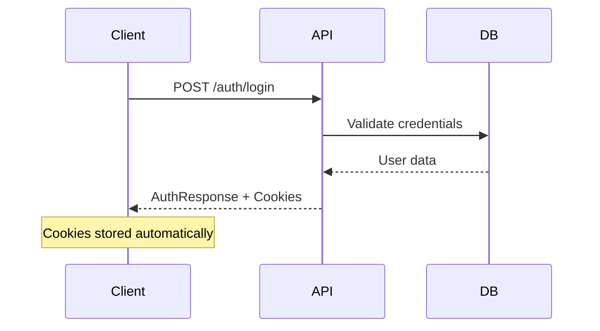
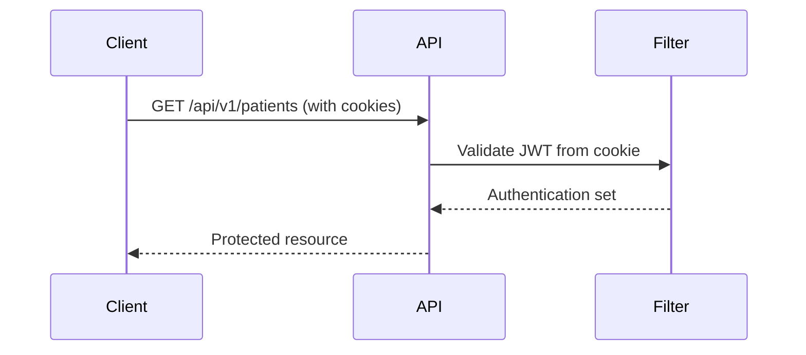
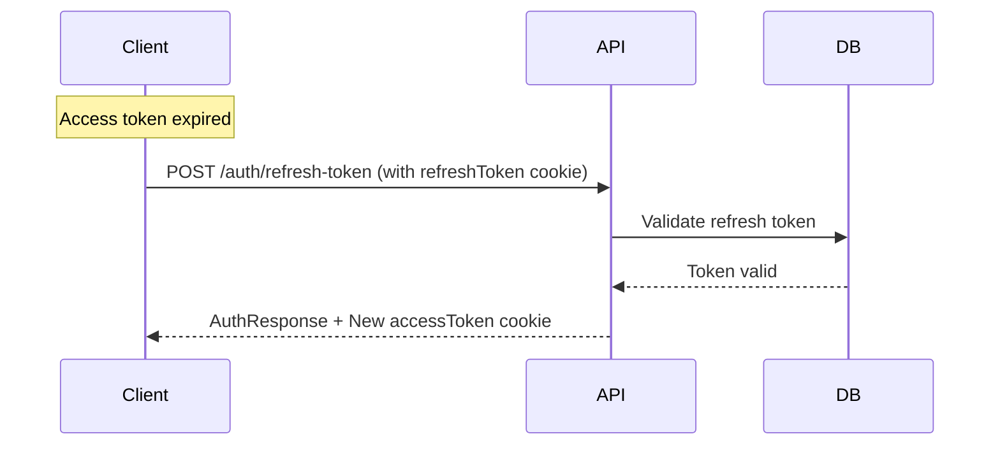

# API Endpoints Reference

Complete reference for all authentication-related API endpoints.

---

## Base URL
```
http://localhost:8080/api/v1/auth
```

---

## Endpoints

### 1. Register User

**Endpoint:** `POST /api/v1/auth/register`

**Access:** Public (no authentication required)

**Description:** Creates a new user account and automatically logs them in.

**Request Body:**
```json
{
  "username": "john.doe",
  "password": "SecurePass123!",
  "fullName": "John Doe",
  "department": "Emergency",
  "role": "DOCTOR"
}
```

**Request Fields:**
| Field | Type | Required | Description |
|-------|------|----------|-------------|
| username | string | ✅ | Unique username (max 50 chars) |
| password | string | ✅ | Password (will be hashed) |
| fullName | string | ✅ | User's full name |
| department | string | ❌ | Department name (must exist in DB) |
| role | string | ❌ | Role name (defaults to "RECEPTION") |

**Response:** `200 OK`
```json
{
  "username": "john.doe",
  "role": "DOCTOR",
  "permissions": [
    "MOD_PATIENTS",
    "MOD_APPOINTMENTS"
  ]
}
```

**Cookies Set:**
- `accessToken` - JWT (15 minutes, HttpOnly)
- `refreshToken` - UUID (7 days, HttpOnly)

**Error Responses:**
- `400 Bad Request` - Username already taken
- `400 Bad Request` - Department not found
- `400 Bad Request` - Role not found

---

### 2. Login

**Endpoint:** `POST /api/v1/auth/login`

**Access:** Public

**Description:** Authenticates user credentials and issues tokens.

**Request Body:**
```json
{
  "username": "john.doe",
  "password": "SecurePass123!"
}
```

**Request Fields:**
| Field | Type | Required | Description |
|-------|------|----------|-------------|
| username | string | ✅ | User's username |
| password | string | ✅ | User's password |

**Response:** `200 OK`
```json
{
  "username": "john.doe",
  "role": "DOCTOR",
  "permissions": [
    "MOD_PATIENTS",
    "MOD_APPOINTMENTS"
  ]
}
```

**Cookies Set:**
- `accessToken` - JWT (15 minutes, HttpOnly)
- `refreshToken` - UUID (7 days, HttpOnly)

**Error Responses:**
- `401 Unauthorized` - Invalid credentials
- `404 Not Found` - User not found

---

### 3. Refresh Token

**Endpoint:** `POST /api/v1/auth/refresh-token`

**Access:** Public

**Description:** Issues a new access token using a valid refresh token.

**Request Body (Optional):**
```json
{
  "refreshToken": "a1b2c3d4-e5f6-7890-abcd-ef1234567890"
}
```

**OR via Cookie:**
```
Cookie: refreshToken=a1b2c3d4-e5f6-7890-abcd-ef1234567890
```

**Request Fields:**
| Field | Type | Required | Description |
|-------|------|----------|-------------|
| refreshToken | string | ❌ | Refresh token (can come from cookie) |

**Response:** `200 OK`
```json
{
  "username": "john.doe",
  "role": "DOCTOR",
  "permissions": [
    "MOD_PATIENTS",
    "MOD_APPOINTMENTS"
  ]
}
```

**Cookies Set:**
- `accessToken` - New JWT (15 minutes, HttpOnly)

**Note:** Refresh token is NOT regenerated

**Error Responses:**
- `400 Bad Request` - Refresh token missing
- `400 Bad Request` - Refresh token not in database
- `400 Bad Request` - Refresh token expired

---

### 4. Logout

**Endpoint:** `POST /api/v1/auth/logout`

**Access:** Protected (requires authentication)

**Description:** Logs out the user by clearing cookies.

**Request Body:** None

**Response:** `200 OK` (empty body)

**Cookies Cleared:**
- `accessToken` - Set to empty with maxAge=0
- `refreshToken` - Set to empty with maxAge=0

**Error Responses:**
- `401 Unauthorized` - Not authenticated

---

### 5. Get Current User

**Endpoint:** `GET /api/v1/auth/me`

**Access:** Protected (requires authentication)

**Description:** Returns information about the currently authenticated user.

**Request Body:** None

**Response:** `200 OK`
```json
{
  "username": "john.doe",
  "role": "DOCTOR",
  "permissions": [
    "MOD_PATIENTS",
    "MOD_APPOINTMENTS",
    "CMP_MEDICAL_RECORDS_READ"
  ]
}
```

**Error Responses:**
- `401 Unauthorized` - Not authenticated
- `404 Not Found` - User not found

---

## Authentication Flow

### Initial Authentication


### Authenticated Request


### Token Refresh


---

## Cookie Details

### Access Token Cookie
```
Set-Cookie: accessToken=<JWT>; 
            Path=/; 
            HttpOnly; 
            SameSite=Lax; 
            Max-Age=900
```

**Properties:**
- **Name:** `accessToken`
- **Value:** JWT string
- **Max-Age:** 900 seconds (15 minutes)
- **HttpOnly:** Yes (JavaScript cannot access)
- **Secure:** Yes in production (HTTPS only)
- **SameSite:** Lax (CSRF protection)
- **Path:** / (all endpoints)

### Refresh Token Cookie
```
Set-Cookie: refreshToken=<UUID>; 
            Path=/; 
            HttpOnly; 
            SameSite=Lax; 
            Max-Age=604800
```

**Properties:**
- **Name:** `refreshToken`
- **Value:** UUID string
- **Max-Age:** 604800 seconds (7 days)
- **HttpOnly:** Yes
- **Secure:** Yes in production
- **SameSite:** Lax
- **Path:** /

---

## Error Response Format

All error responses follow this format:

```json
{
  "error": "Error Type",
  "message": "Detailed error message"
}
```

### Common Error Types

**401 Unauthorized**
```json
{
  "error": "Unauthorized",
  "message": "Full authentication is required to access this resource"
}
```

**403 Forbidden**
```json
{
  "error": "Forbidden",
  "message": "Access is denied"
}
```

**400 Bad Request**
```json
{
  "error": "Bad Request",
  "message": "Username is already taken!"
}
```

---

## CORS Configuration

**Allowed Origins:**
- `http://localhost:4200` (Angular dev server)

**Allowed Methods:**
- GET, POST, PUT, DELETE, OPTIONS, PATCH

**Allowed Headers:**
- Authorization
- Cache-Control
- Content-Type

**Credentials:**
- Enabled (cookies allowed)

---

## Testing with cURL

### Register
```bash
curl -X POST http://localhost:8080/api/v1/auth/register \
  -H "Content-Type: application/json" \
  -d '{
    "username": "test.user",
    "password": "TestPass123!",
    "fullName": "Test User",
    "role": "RECEPTION"
  }' \
  -c cookies.txt
```

### Login
```bash
curl -X POST http://localhost:8080/api/v1/auth/login \
  -H "Content-Type: application/json" \
  -d '{
    "username": "test.user",
    "password": "TestPass123!"
  }' \
  -c cookies.txt
```

### Get Current User
```bash
curl -X GET http://localhost:8080/api/v1/auth/me \
  -b cookies.txt
```

### Refresh Token
```bash
curl -X POST http://localhost:8080/api/v1/auth/refresh-token \
  -b cookies.txt \
  -c cookies.txt
```

### Logout
```bash
curl -X POST http://localhost:8080/api/v1/auth/logout \
  -b cookies.txt
```

---

## Frontend Integration (Angular)

### Login Service
```typescript
login(username: string, password: string): Observable<AuthResponse> {
  return this.http.post<AuthResponse>(
    `${this.apiUrl}/auth/login`,
    { username, password },
    { withCredentials: true }  // Important: Send cookies
  );
}
```

### HTTP Interceptor
```typescript
intercept(req: HttpRequest<any>, next: HttpHandler) {
  // Cookies are sent automatically with withCredentials: true
  const authReq = req.clone({
    withCredentials: true
  });
  return next.handle(authReq);
}
```

### Refresh Token Interceptor
```typescript
intercept(req: HttpRequest<any>, next: HttpHandler) {
  return next.handle(req).pipe(
    catchError((error: HttpErrorResponse) => {
      if (error.status === 401) {
        // Access token expired, refresh it
        return this.authService.refreshToken().pipe(
          switchMap(() => next.handle(req))
        );
      }
      return throwError(error);
    })
  );
}
```

---

## Security Considerations

### Best Practices
1. ✅ Always use HTTPS in production
2. ✅ Set `secure-cookie=true` in production
3. ✅ Implement rate limiting for login attempts
4. ✅ Add CAPTCHA for repeated failed logins
5. ✅ Log authentication events for auditing
6. ✅ Implement password strength requirements
7. ✅ Add email verification for new accounts

### Token Lifetimes
- **Access Token:** 15 minutes (short-lived for security)
- **Refresh Token:** 7 days (balance between security and UX)

### Cookie Security
- **HttpOnly:** Prevents XSS attacks
- **Secure:** Prevents man-in-the-middle attacks
- **SameSite=Lax:** Prevents CSRF attacks

---

## Related Documentation

- [Authentication System Overview](file:///home/artem/test/hms-final/auth_docs/authentication_system_overview.md)
- [AuthService Detailed Walkthrough](file:///home/artem/test/hms-final/auth_docs/authservice_detailed_walkthrough.md)
- [Data Models](file:///home/artem/test/hms-final/auth_docs/data_models.md)
