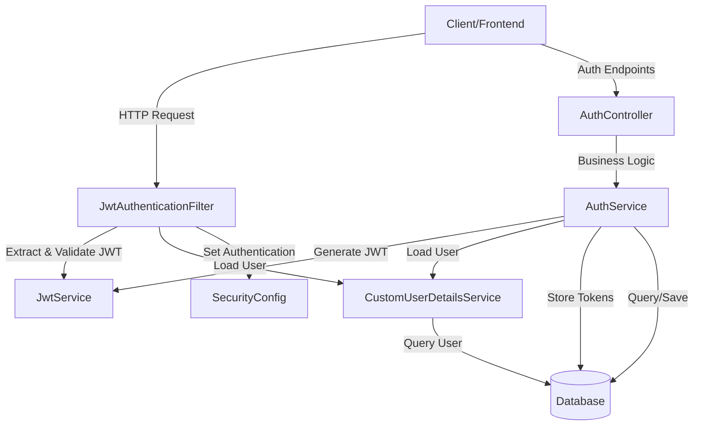
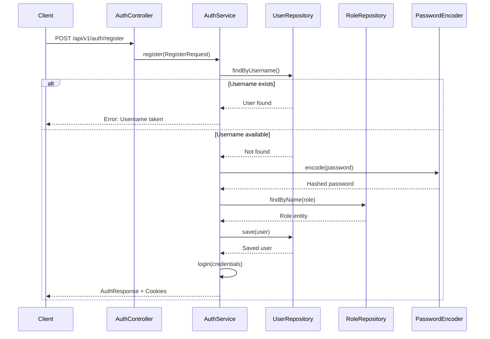
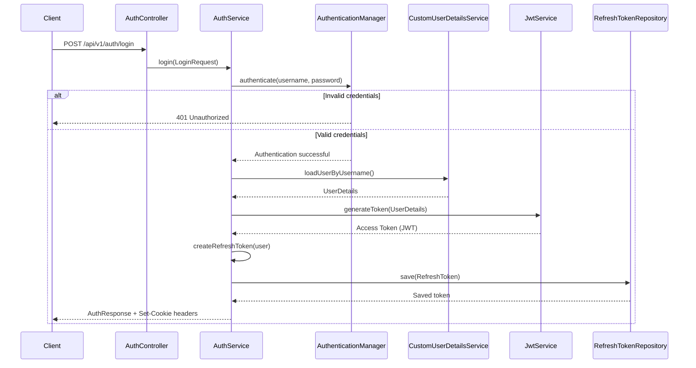
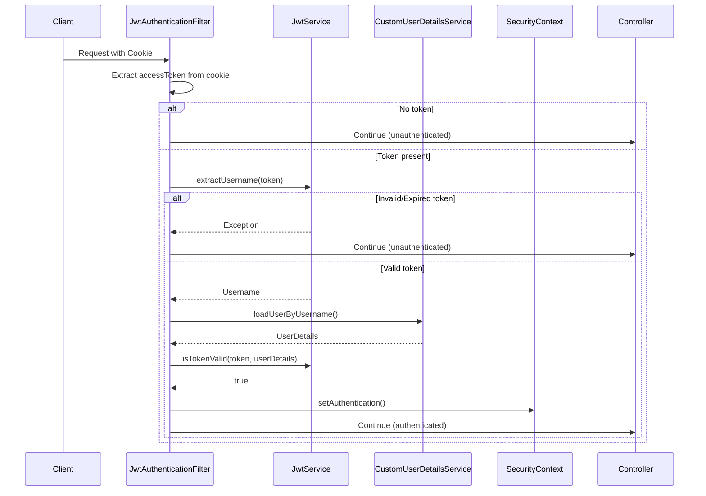
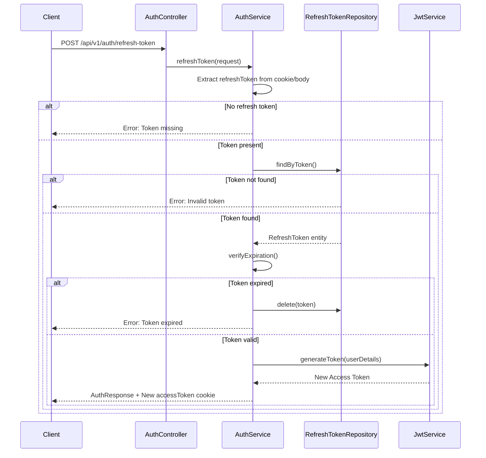
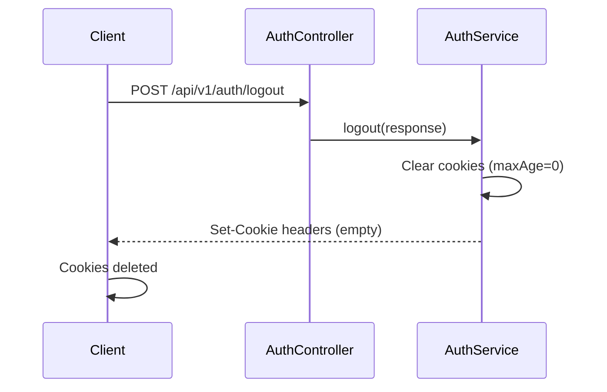
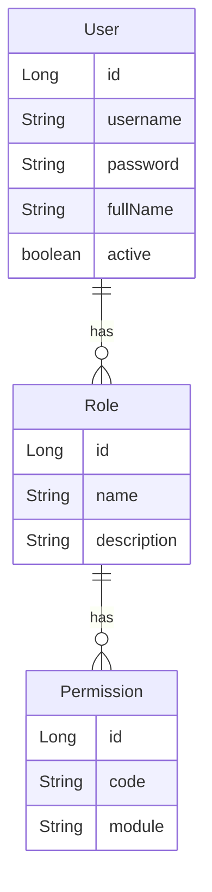

# Hospital Management System - Authentication System Overview

## Table of Contents
1. [System Architecture](#system-architecture)
2. [Authentication Flow](#authentication-flow)
3. [Component Overview](#component-overview)
4. [Security Features](#security-features)
5. [Configuration](#configuration)

---

## System Architecture

The HMS authentication system is built using **Spring Security** with **JWT (JSON Web Tokens)** for stateless authentication. The system implements a **dual-token strategy** (Access Token + Refresh Token) with **cookie-based storage** for enhanced security.

### High-Level Architecture



### Key Components

| Component | Purpose | Location |
|-----------|---------|----------|
| **AuthController** | REST API endpoints for authentication | `controller/AuthController.java` |
| **AuthService** | Business logic for auth operations | `service/AuthService.java` |
| **JwtService** | JWT token generation and validation | `service/JwtService.java` |
| **CustomUserDetailsService** | Load user details for Spring Security | `security/CustomUserDetailsService.java` |
| **JwtAuthenticationFilter** | Intercepts requests to validate JWT | `security/JwtAuthenticationFilter.java` |
| **SecurityConfig** | Spring Security configuration | `config/SecurityConfig.java` |
| **JwtAuthenticationEntryPoint** | Handles unauthorized access | `security/JwtAuthenticationEntryPoint.java` |
| **CustomAccessDeniedHandler** | Handles forbidden access | `security/CustomAccessDeniedHandler.java` |

---

## Authentication Flow

### 1. Registration Flow



**Steps:**
1. Client sends registration data (username, password, fullName, department, role)
2. `AuthService` checks if username already exists
3. Password is hashed using BCrypt
4. Role is normalized and fetched from database (defaults to "RECEPTION")
5. Department is linked if provided
6. User entity is saved to database
7. Automatically logs in the user and returns tokens

### 2. Login Flow



**Steps:**
1. Client sends username and password
2. `AuthenticationManager` validates credentials against database
3. `CustomUserDetailsService` loads user details with roles and permissions
4. `JwtService` generates a signed JWT access token (15 minutes validity)
5. `AuthService` creates/updates refresh token (7 days validity)
6. Both tokens are sent as HttpOnly cookies
7. Response includes username, role, and permissions

### 3. Request Authentication Flow (Every Protected Request)



**Steps:**
1. `JwtAuthenticationFilter` intercepts every request
2. Extracts `accessToken` from cookies
3. Validates token signature and expiration
4. Loads user details from database
5. Sets authentication in Spring Security context
6. Request proceeds to controller with authenticated user

### 4. Token Refresh Flow



**Steps:**
1. Client sends refresh token (from cookie or request body)
2. `AuthService` validates refresh token against database
3. Checks if token is expired
4. Generates new access token
5. Returns new access token in cookie
6. Refresh token remains unchanged

### 5. Logout Flow



**Steps:**
1. Client calls logout endpoint
2. `AuthService` sets both cookies with `maxAge=0`
3. Browser deletes the cookies
4. User is logged out

---

## Component Overview

### 1. AuthController
**File:** [`controller/AuthController.java`](file:///home/artem/test/hms-final/hms-backend/src/main/java/com/hms/HospitalManagementSystem/controller/AuthController.java)

**Purpose:** Exposes REST API endpoints for authentication operations.

**Endpoints:**

| Method | Endpoint | Description | Public |
|--------|----------|-------------|--------|
| POST | `/api/v1/auth/register` | Register new user | ✅ |
| POST | `/api/v1/auth/login` | Login user | ✅ |
| POST | `/api/v1/auth/refresh-token` | Refresh access token | ✅ |
| POST | `/api/v1/auth/logout` | Logout user | ❌ |
| GET | `/api/v1/auth/me` | Get current user info | ❌ |

**Key Features:**
- All endpoints return `AuthResponse` containing username, role, and permissions
- Tokens are automatically set as HttpOnly cookies
- Uses `@RequiredArgsConstructor` for dependency injection

### 2. AuthService
**File:** [`service/AuthService.java`](file:///home/artem/test/hms-final/hms-backend/src/main/java/com/hms/HospitalManagementSystem/service/AuthService.java)

**Purpose:** Contains all business logic for authentication operations.

**Key Methods:**

#### `register(RegisterRequest, HttpServletResponse)`
- Validates username uniqueness
- Hashes password with BCrypt
- Normalizes role names (e.g., "Front Desk" → "RECEPTION")
- Links user to department
- Automatically logs in after registration

#### `login(LoginRequest, HttpServletResponse)`
- Authenticates credentials via `AuthenticationManager`
- Generates access token (JWT)
- Creates/updates refresh token
- Sets both tokens as cookies
- Returns user info with roles and permissions

#### `refreshToken(RefreshTokenRequest, HttpServletRequest, HttpServletResponse)`
- Accepts refresh token from cookie or request body
- Validates token against database
- Checks expiration
- Generates new access token
- Returns updated user info

#### `logout(HttpServletResponse)`
- Clears both access and refresh token cookies

#### `getCurrentUser(String username)`
- Fetches user details from database
- Returns username, role, and permissions

#### `createRefreshToken(User)`
- Creates or updates refresh token for user
- Sets expiration to 7 days
- Stores in database

#### `verifyExpiration(RefreshToken)`
- Checks if refresh token is expired
- Deletes expired tokens from database

#### `normalizeRoleName(String)`
- Maps various role inputs to standard names
- Examples:
  - "Front Desk" → "RECEPTION"
  - "Administrator" → "ADMIN"
  - "Lab Technician" → "LAB_TECH"

**Dependencies:**
- `UserRepository` - User CRUD operations
- `RoleRepository` - Role lookups
- `DepartmentRepository` - Department lookups
- `RefreshTokenRepository` - Refresh token storage
- `PasswordEncoder` - BCrypt password hashing
- `JwtService` - JWT token operations
- `AuthenticationManager` - Credential validation
- `CustomUserDetailsService` - User details loading

**Configuration Properties:**
- `jwt.expiration` - Access token validity (15 minutes)
- `jwt.refresh-expiration` - Refresh token validity (7 days)
- `app.security.secure-cookie` - Enable HTTPS-only cookies

### 3. JwtService
**File:** [`service/JwtService.java`](file:///home/artem/test/hms-final/hms-backend/src/main/java/com/hms/HospitalManagementSystem/service/JwtService.java)

**Purpose:** Handles all JWT token operations using the `io.jsonwebtoken` library.

**Key Methods:**

#### `generateToken(UserDetails)`
- Creates JWT with username as subject
- Signs with HS256 algorithm
- Sets expiration time
- Returns compact JWT string

#### `extractUsername(String token)`
- Parses JWT and extracts subject (username)

#### `isTokenValid(String token, UserDetails)`
- Validates token signature
- Checks if username matches
- Verifies token is not expired

#### `extractClaim(String token, Function<Claims, T>)`
- Generic method to extract any claim from JWT

**Internal Methods:**
- `buildToken()` - Constructs JWT with claims
- `extractAllClaims()` - Parses and validates JWT
- `getSignInKey()` - Decodes Base64 secret key
- `isTokenExpired()` - Checks expiration date
- `extractExpiration()` - Gets expiration claim

**Configuration:**
- `jwt.secret` - Base64-encoded secret key (256-bit minimum)
- `jwt.expiration` - Token validity in milliseconds

### 4. CustomUserDetailsService
**File:** [`security/CustomUserDetailsService.java`](file:///home/artem/test/hms-final/hms-backend/src/main/java/com/hms/HospitalManagementSystem/security/CustomUserDetailsService.java)

**Purpose:** Implements Spring Security's `UserDetailsService` to load user-specific data.

**Key Method:**

#### `loadUserByUsername(String username)`
1. Queries database for user by username
2. Throws `UsernameNotFoundException` if not found
3. Converts roles to Spring Security authorities (prefixed with `ROLE_`)
4. Converts permissions to authorities (using permission codes)
5. Returns Spring Security `UserDetails` object

**Authority Mapping:**
- Role: `ADMIN` → Authority: `ROLE_ADMIN`
- Permission: `MOD_PATIENTS` → Authority: `MOD_PATIENTS`

**User Details:**
- Username
- Hashed password
- Enabled status (`user.isActive()`)
- Account status flags (all set to `true`)
- Authorities (roles + permissions)

### 5. JwtAuthenticationFilter
**File:** [`security/JwtAuthenticationFilter.java`](file:///home/artem/test/hms-final/hms-backend/src/main/java/com/hms/HospitalManagementSystem/security/JwtAuthenticationFilter.java)

**Purpose:** Intercepts every HTTP request to validate JWT tokens and set authentication context.

**Execution Flow:**

1. **Extract Token from Cookie**
   - Searches for `accessToken` cookie
   - Skips if no cookie found

2. **Parse and Validate Token**
   - Extracts username from JWT
   - Handles exceptions:
     - `IllegalArgumentException` - Malformed token
     - `ExpiredJwtException` - Token expired
     - `MalformedJwtException` - Invalid format

3. **Load User Details**
   - Calls `CustomUserDetailsService.loadUserByUsername()`
   - Retrieves user with roles and permissions

4. **Validate Token**
   - Verifies signature
   - Checks username match
   - Confirms not expired

5. **Set Authentication**
   - Creates `UsernamePasswordAuthenticationToken`
   - Includes user details and authorities
   - Sets in `SecurityContextHolder`

6. **Continue Filter Chain**
   - Passes request to next filter
   - Controller receives authenticated user

**Error Handling:**
- Logs errors but doesn't block request
- Invalid tokens result in unauthenticated requests
- Security config handles unauthorized access

### 6. SecurityConfig
**File:** [`config/SecurityConfig.java`](file:///home/artem/test/hms-final/hms-backend/src/main/java/com/hms/HospitalManagementSystem/config/SecurityConfig.java)

**Purpose:** Configures Spring Security for the application.

**Configuration Details:**

#### Security Filter Chain
1. **CSRF Disabled** - Not needed for stateless JWT auth
2. **CORS Enabled** - Configured for `http://localhost:4200`
3. **Session Management** - Stateless (no server-side sessions)
4. **Exception Handling**
   - Unauthorized: `JwtAuthenticationEntryPoint` (401)
   - Forbidden: `CustomAccessDeniedHandler` (403)
5. **Authorization Rules**
   - `/api/v1/auth/**` - Public
   - `/api/v1/public/**` - Public
   - `/v3/api-docs/**`, `/swagger-ui/**` - Public (Swagger)
   - All other endpoints - Authenticated
6. **JWT Filter** - Added before `UsernamePasswordAuthenticationFilter`

#### Beans

**`securityFilterChain(HttpSecurity)`**
- Main security configuration
- Defines all security rules

**`daoAuthenticationProvider()`**
- Connects `CustomUserDetailsService` with `PasswordEncoder`
- Used by `AuthenticationManager`

**`passwordEncoder()`**
- Returns `BCryptPasswordEncoder`
- Used for password hashing

**`authenticationManager(AuthenticationConfiguration)`**
- Exposes Spring's authentication manager
- Used in `AuthService` for login

**`corsConfigurationSource()`**
- Allows requests from `http://localhost:4200`
- Permits all HTTP methods
- Allows credentials (cookies)
- Allows specific headers

### 7. JwtAuthenticationEntryPoint
**File:** [`security/JwtAuthenticationEntryPoint.java`](file:///home/artem/test/hms-final/hms-backend/src/main/java/com/hms/HospitalManagementSystem/security/JwtAuthenticationEntryPoint.java)

**Purpose:** Handles unauthorized access attempts (401 errors).

**Behavior:**
- Returns HTTP 401 status
- Sends JSON error response
- Includes error message from exception

**Example Response:**
```json
{
  "error": "Unauthorized",
  "message": "Full authentication is required to access this resource"
}
```

### 8. CustomAccessDeniedHandler
**File:** [`security/CustomAccessDeniedHandler.java`](file:///home/artem/test/hms-final/hms-backend/src/main/java/com/hms/HospitalManagementSystem/security/CustomAccessDeniedHandler.java)

**Purpose:** Handles forbidden access attempts (403 errors).

**Behavior:**
- Returns HTTP 403 status
- Sends JSON error response
- Includes error message from exception

**Example Response:**
```json
{
  "error": "Forbidden",
  "message": "Access is denied"
}
```

---

## Security Features

### 1. Password Security
- **BCrypt Hashing** - Industry-standard password hashing
- **Salt Generation** - Automatic per-password salts
- **Adaptive Hashing** - Configurable work factor

### 2. Token Security

#### Access Token (JWT)
- **Short-lived** - 15 minutes validity
- **Stateless** - No server-side storage
- **Signed** - HS256 algorithm with secret key
- **Claims** - Contains username and expiration

#### Refresh Token
- **Long-lived** - 7 days validity
- **Database-backed** - Stored and validated server-side
- **One-per-user** - Replaces existing token on login
- **Automatic cleanup** - Expired tokens deleted on validation

### 3. Cookie Security
- **HttpOnly** - Not accessible via JavaScript (XSS protection)
- **Secure** - HTTPS-only in production (configurable)
- **SameSite=Lax** - CSRF protection
- **Path=/** - Available to all endpoints

### 4. Role-Based Access Control (RBAC)

#### Entity Model


#### Standard Roles
- **ADMIN** - Full system access
- **DOCTOR** - Medical staff access
- **NURSE** - Nursing staff access
- **LAB_TECH** - Laboratory access
- **RECEPTION** - Front desk access

#### Permission Structure
- Permissions are granular (e.g., `MOD_PATIENTS`, `CMP_ADMIN_USER_READ`)
- Roles can have multiple permissions
- Users can have multiple roles
- Authorities include both roles and permissions

### 5. CORS Configuration
- **Allowed Origins** - `http://localhost:4200`
- **Allowed Methods** - GET, POST, PUT, DELETE, OPTIONS, PATCH
- **Allowed Headers** - Authorization, Cache-Control, Content-Type
- **Credentials** - Enabled (allows cookies)

### 6. Exception Handling
- **Unauthorized (401)** - Missing or invalid authentication
- **Forbidden (403)** - Insufficient permissions
- **Consistent Format** - JSON error responses

---

## Configuration

### Application Properties
**File:** [`application.properties`](file:///home/artem/test/hms-final/hms-backend/src/main/resources/application.properties)

```properties
# JWT Configuration
jwt.expiration=900000                    # 15 minutes (milliseconds)
jwt.refresh-expiration=604800000         # 7 days (milliseconds)
jwt.secret=VGhpc0lzQVNlY3JldEtleVGhhdElzTG9uZ0Vub3VnaEZvckhTMjU2QWxnb3JpdGht

# Security Configuration
app.security.secure-cookie=false         # Set to true in production (HTTPS)

# Database Configuration
spring.datasource.url=jdbc:mysql://localhost:3306/hospital_db?createDatabaseIfNotExist=true
spring.datasource.username=Arashad
spring.datasource.password=Arashad@6139

# Logging
logging.level.org.springframework.security=DEBUG
```

### Environment-Specific Configuration

#### Development
- `app.security.secure-cookie=false` - Allow HTTP cookies
- `logging.level.org.springframework.security=DEBUG` - Detailed logs

#### Production
- `app.security.secure-cookie=true` - HTTPS-only cookies
- Generate strong JWT secret (256-bit minimum)
- Use environment variables for secrets
- Enable HTTPS
- Update CORS allowed origins

### Database Schema

#### Tables
- `users` - User accounts
- `roles` - Role definitions
- `permissions` - Permission definitions
- `user_roles` - User-Role mapping (many-to-many)
- `role_permissions` - Role-Permission mapping (many-to-many)
- `refresh_tokens` - Refresh token storage
- `departments` - Department definitions

---

## Related Documentation

- [AuthService Detailed Walkthrough](file:///home/artem/test/hms-final/auth_docs/authservice_detailed_walkthrough.md)
- [Security Configuration Guide](file:///home/artem/test/hms-final/auth_docs/security_configuration_guide.md)
- [API Endpoints Reference](file:///home/artem/test/hms-final/auth_docs/api_endpoints_reference.md)
- [Data Models](file:///home/artem/test/hms-final/auth_docs/data_models.md)
