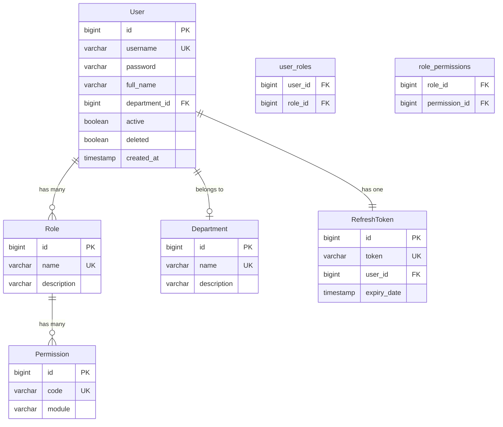

# Authentication System - Data Models

This document describes all data models (entities and DTOs) used in the authentication system.

---

## Entity Models

### User Entity
**File:** [`entity/User.java`](file:///home/artem/test/hms-final/hms-backend/src/main/java/com/hms/HospitalManagementSystem/entity/User.java)

```java
@Entity
@Table(name = "users")
public class User {
    @Id
    @GeneratedValue(strategy = GenerationType.IDENTITY)
    private Long id;

    @Column(unique = true, nullable = false, length = 50)
    private String username;

    @Column(nullable = false)
    private String password;  // BCrypt hashed

    @Column(name = "full_name", length = 100)
    private String fullName;

    @ManyToOne(fetch = FetchType.EAGER)
    @JoinColumn(name = "department_id")
    private Department department;

    @Column(nullable = false)
    private boolean active = true;

    @Column(nullable = false)
    private boolean deleted = false;

    @Column(name = "created_at", updatable = false)
    private LocalDateTime createdAt;

    @ManyToMany(fetch = FetchType.EAGER)
    @JoinTable(
        name = "user_roles",
        joinColumns = @JoinColumn(name = "user_id"),
        inverseJoinColumns = @JoinColumn(name = "role_id")
    )
    private Set<Role> roles = new HashSet<>();
}
```

**Fields:**
- `id` - Primary key (auto-generated)
- `username` - Unique login identifier
- `password` - BCrypt hashed password (never plaintext)
- `fullName` - Display name
- `department` - Foreign key to Department entity
- `active` - Account enabled/disabled flag
- `deleted` - Soft delete flag
- `createdAt` - Account creation timestamp
- `roles` - Many-to-many relationship with Role

**Relationships:**
- Many-to-One with `Department`
- Many-to-Many with `Role`
- One-to-One with `RefreshToken`

---

### Role Entity
**File:** [`entity/Role.java`](file:///home/artem/test/hms-final/hms-backend/src/main/java/com/hms/HospitalManagementSystem/entity/Role.java)

```java
@Entity
@Table(name = "roles")
public class Role {
    @Id
    @GeneratedValue(strategy = GenerationType.IDENTITY)
    private Long id;

    @Column(unique = true, nullable = false, length = 50)
    private String name;  // e.g., ADMIN, DOCTOR, NURSE

    @Column
    private String description;

    @ManyToMany(fetch = FetchType.EAGER)
    @JoinTable(
        name = "role_permissions",
        joinColumns = @JoinColumn(name = "role_id"),
        inverseJoinColumns = @JoinColumn(name = "permission_id")
    )
    private Set<Permission> permissions = new HashSet<>();
}
```

**Fields:**
- `id` - Primary key
- `name` - Unique role identifier (e.g., "ADMIN", "DOCTOR")
- `description` - Human-readable description
- `permissions` - Many-to-many relationship with Permission

**Standard Roles:**
- `ADMIN` - System administrators
- `DOCTOR` - Medical doctors
- `NURSE` - Nursing staff
- `LAB_TECH` - Laboratory technicians
- `RECEPTION` - Front desk staff

---

### Permission Entity
**File:** [`entity/Permission.java`](file:///home/artem/test/hms-final/hms-backend/src/main/java/com/hms/HospitalManagementSystem/entity/Permission.java)

```java
@Entity
@Table(name = "permissions")
public class Permission {
    @Id
    @GeneratedValue(strategy = GenerationType.IDENTITY)
    private Long id;

    @Column(unique = true, nullable = false, length = 50)
    private String code;  // e.g., MOD_PATIENTS, CMP_ADMIN_USER_READ

    @Column(nullable = false, length = 50)
    private String module;
}
```

**Fields:**
- `id` - Primary key
- `code` - Unique permission code (used in authorization)
- `module` - Module/feature this permission belongs to

**Permission Naming Convention:**
- `MOD_*` - Module-level permissions
- `CMP_*` - Component-level permissions
- Examples: `MOD_PATIENTS`, `CMP_ADMIN_USER_READ`

---

### RefreshToken Entity
**File:** [`entity/RefreshToken.java`](file:///home/artem/test/hms-final/hms-backend/src/main/java/com/hms/HospitalManagementSystem/entity/RefreshToken.java)

```java
@Entity
@Table(name = "refresh_tokens")
public class RefreshToken {
    @Id
    @GeneratedValue(strategy = GenerationType.IDENTITY)
    private Long id;

    @Column(nullable = false, unique = true)
    private String token;  // UUID string

    @OneToOne
    @JoinColumn(name = "user_id", referencedColumnName = "id")
    private User user;

    @Column(nullable = false)
    private Instant expiryDate;
}
```

**Fields:**
- `id` - Primary key
- `token` - Random UUID (unique)
- `user` - One-to-one relationship with User
- `expiryDate` - Token expiration timestamp

**Lifecycle:**
- Created/updated on login
- Validated on token refresh
- Deleted when expired
- One token per user (replaces old token)

---

## DTO Models

### LoginRequest
**File:** [`dto/request/LoginRequest.java`](file:///home/artem/test/hms-final/hms-backend/src/main/java/com/hms/HospitalManagementSystem/dto/request/LoginRequest.java)

```java
@Data
public class LoginRequest {
    private String username;
    private String password;
}
```

**Usage:** POST `/api/v1/auth/login`

**Example:**
```json
{
  "username": "john.doe",
  "password": "SecurePass123!"
}
```

---

### RegisterRequest
**File:** [`dto/request/RegisterRequest.java`](file:///home/artem/test/hms-final/hms-backend/src/main/java/com/hms/HospitalManagementSystem/dto/request/RegisterRequest.java)

```java
@Data
public class RegisterRequest {
    private String username;
    private String password;
    private String fullName;
    private String department;  // Optional
    private String role;        // Optional, defaults to RECEPTION
}
```

**Usage:** POST `/api/v1/auth/register`

**Example:**
```json
{
  "username": "jane.smith",
  "password": "SecurePass456!",
  "fullName": "Dr. Jane Smith",
  "department": "Cardiology",
  "role": "DOCTOR"
}
```

---

### RefreshTokenRequest
**File:** [`dto/request/RefreshTokenRequest.java`](file:///home/artem/test/hms-final/hms-backend/src/main/java/com/hms/HospitalManagementSystem/dto/request/RefreshTokenRequest.java)

```java
@Data
public class RefreshTokenRequest {
    private String refreshToken;  // Optional, can come from cookie
}
```

**Usage:** POST `/api/v1/auth/refresh-token`

**Example (Body):**
```json
{
  "refreshToken": "a1b2c3d4-e5f6-7890-abcd-ef1234567890"
}
```

**Example (Cookie):**
```
Cookie: refreshToken=a1b2c3d4-e5f6-7890-abcd-ef1234567890
```

---

### AuthResponse
**File:** [`dto/response/AuthResponse.java`](file:///home/artem/test/hms-final/hms-backend/src/main/java/com/hms/HospitalManagementSystem/dto/response/AuthResponse.java)

```java
@Data
public class AuthResponse {
    private String username;
    private String role;
    private Set<String> permissions;
}
```

**Usage:** Response for login, register, refresh, and getCurrentUser

**Example:**
```json
{
  "username": "jane.smith",
  "role": "DOCTOR",
  "permissions": [
    "MOD_PATIENTS",
    "MOD_APPOINTMENTS",
    "CMP_MEDICAL_RECORDS_READ",
    "CMP_MEDICAL_RECORDS_WRITE"
  ]
}
```

**Note:** Tokens are sent as cookies, not in response body

---

## Database Schema

### Entity-Relationship Diagram



### Table Descriptions

#### `users`
- Stores user accounts
- Password is BCrypt hashed
- Soft delete via `deleted` flag
- Active/inactive via `active` flag

#### `roles`
- Predefined roles (ADMIN, DOCTOR, etc.)
- Can be customized per organization

#### `permissions`
- Granular permissions
- Assigned to roles, not directly to users

#### `departments`
- Organizational units
- Optional for users

#### `refresh_tokens`
- One token per user
- Automatically cleaned up when expired

#### `user_roles` (Join Table)
- Many-to-many relationship
- Users can have multiple roles

#### `role_permissions` (Join Table)
- Many-to-many relationship
- Roles can have multiple permissions

---

## Spring Security Integration

### UserDetails Mapping

`CustomUserDetailsService` converts `User` entity to Spring Security `UserDetails`:

```java
UserDetails = {
    username: user.username,
    password: user.password,  // Hashed
    enabled: user.active,
    authorities: [
        "ROLE_DOCTOR",           // From roles
        "MOD_PATIENTS",          // From permissions
        "CMP_MEDICAL_RECORDS_READ"
    ]
}
```

### Authority Hierarchy

1. **Roles** → Prefixed with `ROLE_` → `ROLE_ADMIN`
2. **Permissions** → Used as-is → `MOD_PATIENTS`

Both are stored as Spring Security `GrantedAuthority` objects.

---

## Data Flow Examples

### Registration Flow
```
RegisterRequest → AuthService
    ↓
User entity created
    ↓
Password hashed (BCrypt)
    ↓
Role fetched from DB
    ↓
User saved to DB
    ↓
Auto-login → JWT + RefreshToken
    ↓
AuthResponse returned
```

### Login Flow
```
LoginRequest → AuthService
    ↓
Credentials validated
    ↓
User loaded from DB
    ↓
JWT generated (15 min)
    ↓
RefreshToken created/updated (7 days)
    ↓
Both tokens set as cookies
    ↓
AuthResponse returned
```

### Request Authentication
```
HTTP Request → JwtAuthenticationFilter
    ↓
Extract JWT from cookie
    ↓
Validate JWT signature
    ↓
Load User from DB
    ↓
Set SecurityContext
    ↓
Request proceeds with authenticated user
```

---

## Related Documentation

- [Authentication System Overview](file:///home/artem/test/hms-final/auth_docs/authentication_system_overview.md)
- [AuthService Detailed Walkthrough](file:///home/artem/test/hms-final/auth_docs/authservice_detailed_walkthrough.md)
- [API Endpoints Reference](file:///home/artem/test/hms-final/auth_docs/api_endpoints_reference.md)
