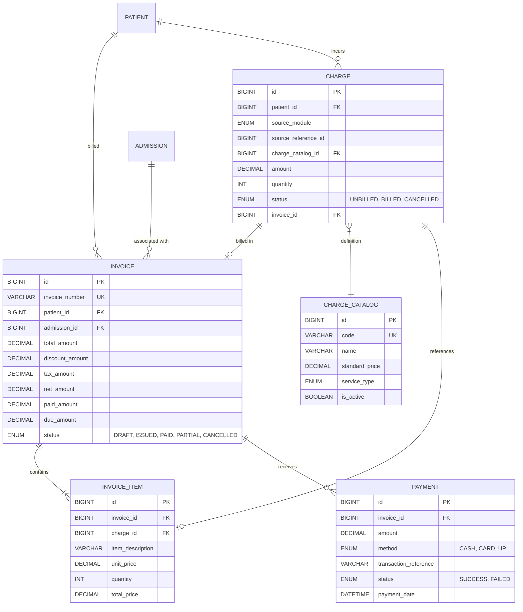

```mermaid
erDiagram
    %% Core Billing Entities
    CHARGE_CATALOG {
        BIGINT id PK
        VARCHAR code UK
        VARCHAR name
        DECIMAL standard_price
        ENUM service_type
        BOOLEAN is_active
    }

    CHARGE {
        BIGINT id PK
        BIGINT patient_id FK
        ENUM source_module
        BIGINT source_reference_id
        BIGINT charge_catalog_id FK
        DECIMAL amount
        INT quantity
        ENUM status "UNBILLED, BILLED, CANCELLED"
        BIGINT invoice_id FK
    }

    INVOICE {
        BIGINT id PK
        VARCHAR invoice_number UK
        BIGINT patient_id FK
        BIGINT admission_id FK
        DECIMAL total_amount
        DECIMAL discount_amount
        DECIMAL tax_amount
        DECIMAL net_amount
        DECIMAL paid_amount
        DECIMAL due_amount
        ENUM status "DRAFT, ISSUED, PAID, PARTIAL, CANCELLED"
    }

    INVOICE_ITEM {
        BIGINT id PK
        BIGINT invoice_id FK
        BIGINT charge_id FK
        VARCHAR item_description
        DECIMAL unit_price
        INT quantity
        DECIMAL total_price
    }

    PAYMENT {
        BIGINT id PK
        BIGINT invoice_id FK
        DECIMAL amount
        ENUM method "CASH, CARD, UPI"
        VARCHAR transaction_reference
        ENUM status "SUCCESS, FAILED"
        DATETIME payment_date
    }

    %% Relationships
    INVOICE ||--|{ INVOICE_ITEM : "contains"
    INVOICE ||--o{ PAYMENT : "receives"
    CHARGE ||--o| INVOICE : "billed in"
    CHARGE }|--|| CHARGE_CATALOG : "definition"
    INVOICE_ITEM |o--|| CHARGE : "references"

    %% External Links (Existing Modules)
    PATIENT ||--o{ INVOICE : "billed"
    PATIENT ||--o{ CHARGE : "incurs"
    ADMISSION ||--o{ INVOICE : "associated with"
```
