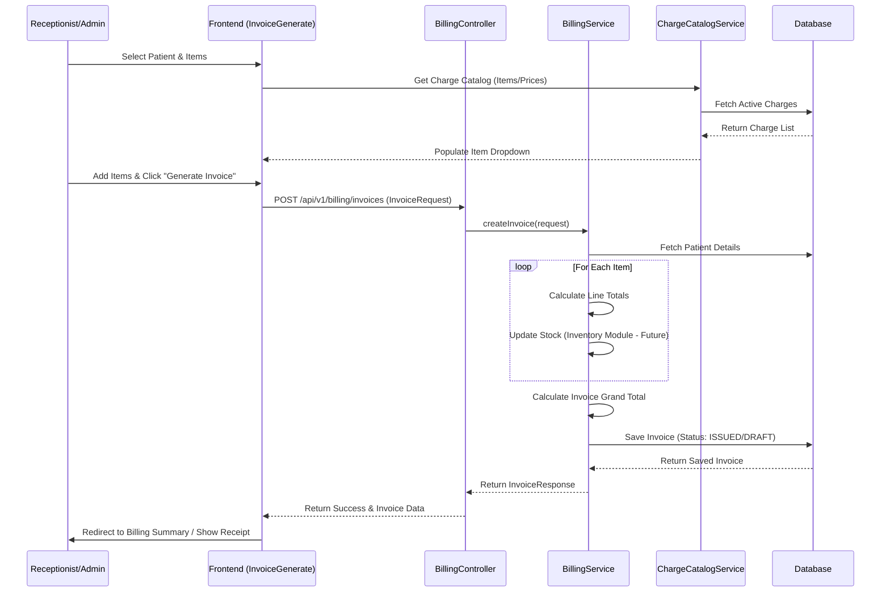
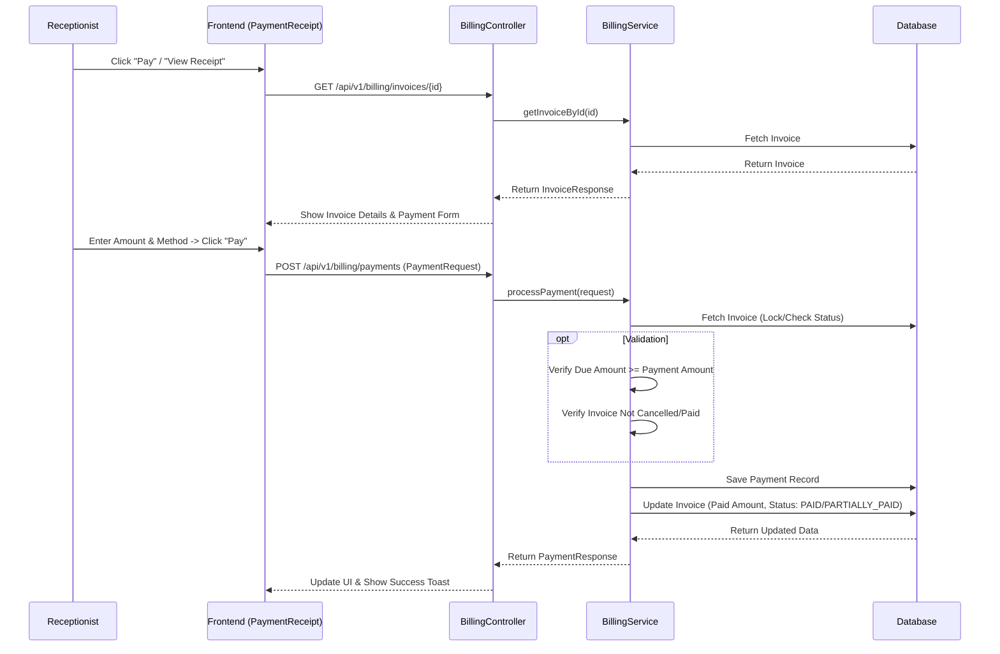
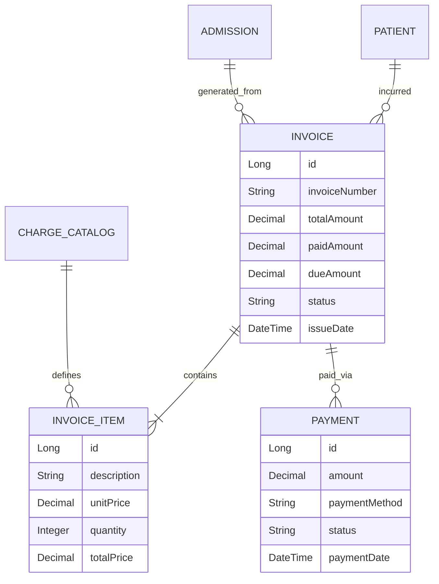

# Billing Module Architecture & Workflow

## Overview
The Billing Module handles the financial aspects of patient visits, including invoice generation, payment processing, and financial reporting. It integrates with the Patient, Admission, and Charge Catalog modules to provide a seamless billing experience.

## Workflow Diagrams

### 1. Invoice Generation Workflow
This workflow describes how an invoice is created, either manually or from an admission.

### 2. Payment Processing Workflow
This workflow details how payments are recorded against an existing invoice.

## Database Schema (Simplified)

## API Endpoints

| Method | Endpoint | Description | Permission |
| :--- | :--- | :--- | :--- |
| `POST` | `/api/v1/billing/invoices` | Create a new invoice | `CMP_INVOICE_GENERATE` |
| `GET` | `/api/v1/billing/invoices/{id}` | Get invoice details | `CMP_INVOICE_GENERATE`, `CMP_BILLING_SUMMARY` |
| `POST` | `/api/v1/billing/payments` | Record a payment | `CMP_PAYMENT_RECEIPT` |
| `GET` | `/api/v1/billing/summary/{patientId}` | Get financial summary for patient | `CMP_BILLING_SUMMARY` |
| `GET` | `/api/v1/billing/invoices` | Get all invoices (Admin/Audit) | `CMP_BILLING_SUMMARY` |
