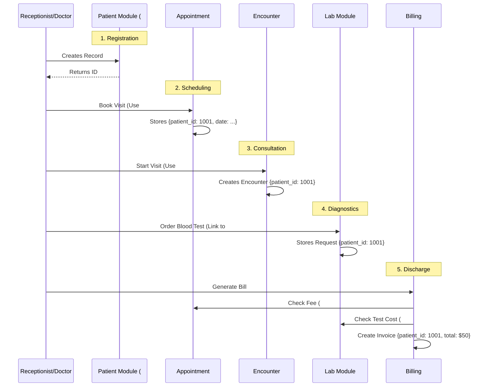

# HMS Data Integration Guide

This document outlines the architectural strategy for integrating future modules (Appointments, Consultation, Lab, IPD, Billing) with the core **Patient Module**. It details how data flows between these entities and how they rely on the **Patient ID** as the central source of truth.

## 1. The Core Philosophy: "Patient-Centric Data Architecture"

The **Patient Module** is the foundation of the HMS. It is not just a directory of names; it is the **Identity Provider** for the clinical system. 

**Rule #1:** No clinical or administrative action can occur without a valid `patient_id`.
**Rule #2:** All modules "borrow" the Patient Identity to tag their data.

---

## 2. Module Integration Roadmap

### A. Appointment Module (The Entry Point)
**Role:** Schedules the interaction between a Patient and a Doctor.

- **Data Connection:**
  - `APPOINTMENT` table holds `patient_id` (FK).
  - **Frontend Flow:** When booking, the user selects a Patient -> System grabs `patient.id` -> Sends to `POST /appointments`.
- **Integration Point:**
  - **Dashboard:** "Upcoming Appointments" widget in Patient View queries `GET /appointments?patientId={id}`.

### B. Consultation & Encounter Module (The Clinical Core)
**Role:** Captures the medical details of a specific visit.

- **Data Connection:**
  - `ENCOUNTER` table links `patient_id` (FK) and `doctor_id` (FK).
  - `VITALS` table links to `encounter_id`.
- **The "Encounter" Concept:**
  - An Encounter acts as a container for **Vitals**, **Diagnosis**, **Symptoms**, and **Prescriptions**.
  - **Frontend Flow:** Doctor opens "Patient Chart" -> System creates new `Encounter` linked to `patient_id`.
- **Integration Point:**
  - **History View:** "Medical History" tab in Patient View queries `GET /encounters?patientId={id}` to show past diagnoses.

### C. Lab Module (Diagnostics)
**Role:** Manages test requests and results.

- **Data Connection:**
  - `LAB_REQUEST` table holds `patient_id` (FK) and `encounter_id` (FK).
  - This dual linkage allows us to answer two questions:
    1.  "Show me all tests for Patient X" (Patient History)
    2.  "Show me all tests ordered during Visit Y" (Encounter Context)
- **Integration Point:**
  - **Results View:** "Lab Reports" tab in Patient View displays `LAB_RESULT` items linked to `patient_id`.

### D. IPD (In-Patient Department)
**Role:** Manages long-term stays, wards, and beds.

- **Data Connection:**
  - `ADMISSION` table holds `patient_id` (FK) and `bed_id` (FK).
  - Status flags: `isActive: true` means the patient is currently in the hospital.
- **Integration Point:**
  - **Admission Status:** The Patient Profile header will show a "Admitted - Ward A" tag if an active admission record is found.

### E. Billing Module (Financials)
**Role:** Aggregates costs and manages payments.

- **Data Connection:**
  - `INVOICE` table holds `patient_id` (FK).
  - **Aggregation Logic:** The billing service scans linked tables (`LAB_REQUEST`, `ADMISSION`, `PHARMACY_ORDER`) for unbilled items associated with `patient_id`.
- **Integration Point:**
  - **Billing Summary:** A "Financials" tab in the Patient View shows outstanding balances.

---

## 3. Visual Data Flow

The following diagram illustrates how the `Patient ID` (#1001) propagates through the system during a typical visit.

## 4. Technical Implementation Notes for Backend

### API Strategy
To support the frontend's "Patient View", the backend must provide endpoints that allow filtering by `patientId`.

- **Medical History:** `GET /api/v1/encounters?patientId=1001`
- **Lab Results:** `GET /api/v1/lab-requests?patientId=1001&status=COMPLETED`
- **Appointments:** `GET /api/v1/appointments?patientId=1001`

### Database Indexing
Since `patient_id` is the most common filter, all transactional tables (`appointments`, `encounters`, `lab_requests`, `invoices`) **MUST** have a database index on the `patient_id` column to ensure performance as data grows.

### Soft Deletes
If a Patient is "Soft Deleted" (`is_deleted = true`), the system must decide whether to hide their historical data or just prevent *new* transactions. Use cases suggest preserving history (read-only) is the correct approach.
