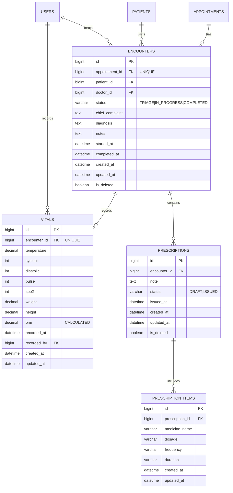

# Database Schema Documentation

## Overview
The Encounter module uses 4 main tables with foreign key relationships to existing tables (appointments, patients, users).

## Entity Relationship Diagram



---

## Table Definitions

### 1. encounters

**Purpose**: Core table representing a patient visit/consultation

| Column | Type | Constraints | Description |
|--------|------|-------------|-------------|
| id | BIGINT | PRIMARY KEY, AUTO_INCREMENT | Unique identifier |
| appointment_id | BIGINT | NOT NULL, UNIQUE, FK → appointments(id) | Links to appointment |
| patient_id | BIGINT | NOT NULL, FK → patients(id) | Patient being treated |
| doctor_id | BIGINT | NOT NULL, FK → users(id) | Treating physician |
| status | VARCHAR(50) | NOT NULL | Current encounter state |
| chief_complaint | TEXT | NULL | Patient's primary concern |
| diagnosis | TEXT | NULL | Doctor's diagnosis |
| notes | TEXT | NULL | Clinical notes |
| started_at | DATETIME | NOT NULL | When encounter began |
| completed_at | DATETIME | NULL | When encounter finished |
| created_at | DATETIME | DEFAULT CURRENT_TIMESTAMP | Record creation time |
| updated_at | DATETIME | DEFAULT CURRENT_TIMESTAMP ON UPDATE | Last modification time |
| is_deleted | BOOLEAN | DEFAULT FALSE | Soft delete flag |

**Indexes**:
```sql
CREATE INDEX idx_encounter_appointment ON encounters(appointment_id);
CREATE INDEX idx_encounter_patient ON encounters(patient_id);
CREATE INDEX idx_encounter_doctor ON encounters(doctor_id);
CREATE INDEX idx_encounter_status ON encounters(status);
```

**Foreign Keys**:
```sql
CONSTRAINT fk_encounter_appointment FOREIGN KEY (appointment_id) REFERENCES appointments(id)
CONSTRAINT fk_encounter_patient FOREIGN KEY (patient_id) REFERENCES patients(id)
CONSTRAINT fk_encounter_doctor FOREIGN KEY (doctor_id) REFERENCES users(id)
```

**Status Values**:
- `TRIAGE`: Initial state, awaiting vitals
- `IN_PROGRESS`: Doctor is consulting
- `COMPLETED`: Encounter finished

**Business Rules**:
- One encounter per appointment (UNIQUE constraint)
- Cannot delete if referenced by vitals/prescriptions
- `completed_at` must be NULL unless status is COMPLETED
- `diagnosis` required before completion

---

### 2. vitals

**Purpose**: Stores patient vital signs recorded during encounter

| Column | Type | Constraints | Description |
|--------|------|-------------|-------------|
| id | BIGINT | PRIMARY KEY, AUTO_INCREMENT | Unique identifier |
| encounter_id | BIGINT | NOT NULL, UNIQUE, FK → encounters(id) | Associated encounter |
| temperature | DECIMAL(5,2) | NULL | Body temperature (°F) |
| systolic | INT | NULL | Systolic blood pressure (mmHg) |
| diastolic | INT | NULL | Diastolic blood pressure (mmHg) |
| pulse | INT | NULL | Heart rate (bpm) |
| spo2 | INT | NULL | Oxygen saturation (%) |
| weight | DECIMAL(5,2) | NULL | Body weight (kg) |
| height | DECIMAL(5,2) | NULL | Height (cm) |
| bmi | DECIMAL(5,2) | NULL | Body Mass Index (calculated) |
| recorded_at | DATETIME | NOT NULL | When vitals were taken |
| recorded_by | BIGINT | NULL, FK → users(id) | User who recorded vitals |
| created_at | DATETIME | DEFAULT CURRENT_TIMESTAMP | Record creation time |
| updated_at | DATETIME | DEFAULT CURRENT_TIMESTAMP ON UPDATE | Last modification time |

**Indexes**:
```sql
CREATE INDEX idx_vitals_encounter ON vitals(encounter_id);
```

**Foreign Keys**:
```sql
CONSTRAINT fk_vitals_encounter FOREIGN KEY (encounter_id) REFERENCES encounters(id)
CONSTRAINT fk_vitals_recorder FOREIGN KEY (recorded_by) REFERENCES users(id)
```

**Calculated Fields**:
- `bmi = weight(kg) / (height(m))²`
- Calculated in application layer before save

**Business Rules**:
- One vitals record per encounter (UNIQUE constraint)
- All vital fields are optional (some may not be measured)
- BMI auto-calculated if weight and height present

---

### 3. prescriptions

**Purpose**: Medication prescriptions issued during encounter

| Column | Type | Constraints | Description |
|--------|------|-------------|-------------|
| id | BIGINT | PRIMARY KEY, AUTO_INCREMENT | Unique identifier |
| encounter_id | BIGINT | NOT NULL, FK → encounters(id) | Associated encounter |
| note | TEXT | NULL | General prescription notes |
| status | VARCHAR(20) | NOT NULL | DRAFT or ISSUED |
| issued_at | DATETIME | NULL | When prescription was issued |
| created_at | DATETIME | DEFAULT CURRENT_TIMESTAMP | Record creation time |
| updated_at | DATETIME | DEFAULT CURRENT_TIMESTAMP ON UPDATE | Last modification time |
| is_deleted | BOOLEAN | DEFAULT FALSE | Soft delete flag |

**Indexes**:
```sql
CREATE INDEX idx_prescription_encounter ON prescriptions(encounter_id);
```

**Foreign Keys**:
```sql
CONSTRAINT fk_prescription_encounter FOREIGN KEY (encounter_id) REFERENCES encounters(id)
```

**Status Values**:
- `DRAFT`: Being prepared, not yet final
- `ISSUED`: Finalized when encounter completed

**Business Rules**:
- Multiple prescriptions per encounter allowed
- Status changes to ISSUED when encounter completed
- `issued_at` set when status becomes ISSUED

---

### 4. prescription_items

**Purpose**: Individual medication entries within a prescription

| Column | Type | Constraints | Description |
|--------|------|-------------|-------------|
| id | BIGINT | PRIMARY KEY, AUTO_INCREMENT | Unique identifier |
| prescription_id | BIGINT | NOT NULL, FK → prescriptions(id) | Parent prescription |
| medicine_name | VARCHAR(255) | NOT NULL | Name of medication |
| dosage | VARCHAR(100) | NULL | Dosage amount |
| frequency | VARCHAR(100) | NULL | How often to take |
| duration | VARCHAR(100) | NULL | How long to take |
| created_at | DATETIME | DEFAULT CURRENT_TIMESTAMP | Record creation time |
| updated_at | DATETIME | DEFAULT CURRENT_TIMESTAMP ON UPDATE | Last modification time |

**Indexes**:
```sql
CREATE INDEX idx_item_prescription ON prescription_items(prescription_id);
```

**Foreign Keys**:
```sql
CONSTRAINT fk_item_prescription FOREIGN KEY (prescription_id) REFERENCES prescriptions(id)
```

**Business Rules**:
- Multiple items per prescription
- Cascade delete with prescription
- All fields except medicine_name are optional

---

## Migration Script

**File**: `V3__Create_Encounter_Module_Tables.sql`

**Location**: `src/main/resources/db/migration/`

**Flyway Version**: 3

**Execution Order**:
1. Create encounters table
2. Create vitals table
3. Create prescriptions table
4. Create prescription_items table
5. Create all indexes

**Rollback Strategy**:
```sql
DROP TABLE IF EXISTS prescription_items;
DROP TABLE IF EXISTS prescriptions;
DROP TABLE IF EXISTS vitals;
DROP TABLE IF EXISTS encounters;
```

---

## Data Integrity

### Referential Integrity
- All foreign keys enforce referential integrity
- Cascade rules defined in JPA entities
- Database-level constraints as backup

### Constraints
- UNIQUE: `encounters.appointment_id`, `vitals.encounter_id`
- NOT NULL: All ID fields, status fields, timestamps
- DEFAULT: Timestamps, boolean flags

### Soft Deletes
- `encounters.is_deleted`
- `prescriptions.is_deleted`
- Allows data retention while hiding from queries

---

## Query Patterns

### Common Queries

**Get encounter with all related data**:
```sql
SELECT e.*, v.*, p.*, pi.*
FROM encounters e
LEFT JOIN vitals v ON v.encounter_id = e.id
LEFT JOIN prescriptions p ON p.encounter_id = e.id
LEFT JOIN prescription_items pi ON pi.prescription_id = p.id
WHERE e.id = ?;
```

**Get triage queue**:
```sql
SELECT e.*, p.first_name, p.last_name
FROM encounters e
JOIN patients p ON p.id = e.patient_id
WHERE e.status = 'TRIAGE'
  AND e.is_deleted = FALSE
ORDER BY e.started_at ASC;
```

**Get doctor's active encounters**:
```sql
SELECT e.*, p.first_name, p.last_name
FROM encounters e
JOIN patients p ON p.id = e.patient_id
WHERE e.doctor_id = ?
  AND e.status = 'IN_PROGRESS'
  AND e.is_deleted = FALSE
ORDER BY e.started_at ASC;
```

**Get patient encounter history**:
```sql
SELECT e.*, u.full_name as doctor_name
FROM encounters e
JOIN users u ON u.id = e.doctor_id
WHERE e.patient_id = ?
  AND e.is_deleted = FALSE
ORDER BY e.started_at DESC;
```

---

## Performance Considerations

### Index Usage
- Status queries use `idx_encounter_status`
- Doctor queries use `idx_encounter_doctor`
- Patient queries use `idx_encounter_patient`
- Appointment lookups use `idx_encounter_appointment`

### Query Optimization
- Avoid N+1 queries with JOIN FETCH in JPA
- Use pagination for large result sets
- Index all foreign keys

### Storage Estimates
- Average encounter: ~2KB
- Average vitals: ~200 bytes
- Average prescription with 3 items: ~500 bytes
- **Total per encounter**: ~2.7KB

**Projected Growth** (1000 encounters/month):
- Month 1: ~2.7MB
- Year 1: ~32MB
- Year 5: ~160MB

---

## Backup & Recovery

### Backup Strategy
- Daily full backups
- Transaction log backups every 15 minutes
- Retention: 30 days

### Critical Data
- Encounters: Medical records (legal requirement)
- Prescriptions: Medication history (legal requirement)
- Vitals: Clinical data (medical necessity)

### Recovery Point Objective (RPO)
- Target: 15 minutes
- Maximum acceptable data loss: 1 hour

---

## Security Considerations

### Sensitive Data
- All medical information is PHI (Protected Health Information)
- Encryption at rest required for production
- Encryption in transit (HTTPS/TLS)

### Access Control
- Row-level security via application layer
- Audit trail in `created_at`, `updated_at`
- Soft deletes preserve history

### Compliance
- HIPAA compliance required
- Data retention policies
- Audit logging
