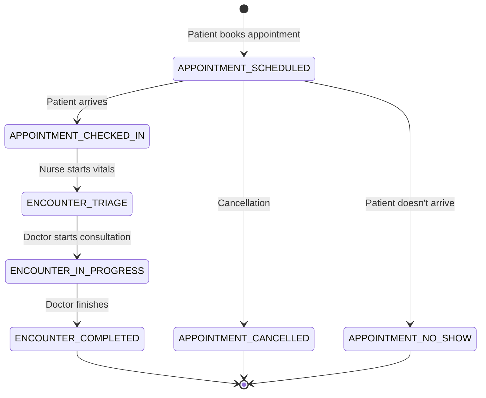

# Encounter Module - Deep Analysis & Planning

> [!IMPORTANT]
> This document provides a comprehensive analysis and design for the Encounter module implementation. It is based on deep reverse engineering of the frontend, alignment with existing database documentation, and production-grade backend design principles.

---

## 1️⃣ High-Level Architecture Overview

### Current System State

The HMS application follows a **patient-centric, event-driven architecture**:

```
PATIENT (Core Entity)
  ├── APPOINTMENT (OPD Entry Point) → Currently Implemented
  │     └── ENCOUNTER (Medical Visit) → **TO BE IMPLEMENTED**
  │            ├── VITALS (Triage Data)
  │            ├── CLINICAL NOTES (Diagnosis, Chief Complaint)
  │            ├── PRESCRIPTION → PRESCRIPTION_ITEM
  │            └── LAB_REQUEST → LAB_RESULT
  │
  └── ADMISSION (IPD Entry Point) → Future
```

### Encounter Module Purpose

The **Encounter** entity serves as the **medical truth** of a patient visit. It:

- Links to exactly ONE [Appointment](file:///home/artem/test/hms-final/hms-backend/src/main/java/com/hms/HospitalManagementSystem/entity/Appointment.java#11-83) (one-to-one relationship)
- Captures the clinical workflow from triage through doctor consultation
- Owns all medical data generated during the visit (vitals, diagnosis, prescriptions, lab orders)
- Tracks the visit lifecycle through status transitions

### Key Design Principles

1. **Separation of Concerns**: Appointment = logistics, Encounter = medical data
2. **State Machine Driven**: Clear status transitions with role-based access control
3. **Idempotency**: Encounter creation is idempotent (nurse can safely retry)
4. **Transactional Integrity**: All encounter operations are atomic
5. **Audit Trail**: All state changes are logged for compliance

---

## 2️⃣ Extracted Frontend Requirements

### 2.1 Frontend Service Analysis

#### EncounterService Interface

**File**: [hms-v3/src/app/features/consultation/services/encounter.service.ts](file:///home/artem/test/hms-final/hms-v3/src/app/features/consultation/services/encounter.service.ts)

**Extracted API Contracts**:

| Method | Expected Backend Endpoint | Request Payload | Response DTO | Notes |
|--------|---------------------------|-----------------|--------------|-------|
| [startEncounter()](file:///home/artem/test/hms-final/hms-v3/src/app/features/consultation/services/encounter.service.ts#45-75) | `POST /api/v1/encounters` | `{ appointmentId, patientId, doctorId }` | `EncounterResponse` | Idempotent - returns existing if already created |
| [saveDiagnosis()](file:///home/artem/test/hms-final/hms-v3/src/app/features/consultation/components/consultation-detail/consultation-detail.component.ts#67-80) | `PATCH /api/v1/encounters/{id}/clinical-notes` | `{ diagnosis, notes, chiefComplaint }` | `EncounterResponse` | Updates clinical data |
| [savePrescription()](file:///home/artem/test/hms-final/hms-v3/src/app/features/consultation/components/prescription/prescription.component.ts#40-43) | `POST /api/v1/encounters/{id}/prescriptions` | `{ items[], note }` | `PrescriptionResponse` | Creates or updates prescription |
| [getPrescription()](file:///home/artem/test/hms-final/hms-v3/src/app/features/consultation/services/encounter.service.ts#124-128) | `GET /api/v1/encounters/{id}/prescriptions` | - | `PrescriptionResponse` | Retrieves prescription for encounter |
| [endEncounter()](file:///home/artem/test/hms-final/hms-v3/src/app/features/consultation/services/encounter.service.ts#129-152) | `PATCH /api/v1/encounters/{id}/complete` | - | `EncounterResponse` | Marks encounter as COMPLETED |

#### Frontend Data Models

```typescript
interface Encounter {
  id: string;
  appointmentId: string;
  patientId: number;
  doctorId: number;
  status: 'TRIAGE' | 'IN_PROGRESS' | 'COMPLETED';
  diagnosis?: string;
  chiefComplaint?: string;  // Missing in current frontend model
  notes?: string;
  startedAt: Date;
  completedAt?: Date;
  vitalsId?: number;
}

interface Prescription {
  id: string;
  encounterId: string;
  items: PrescriptionItem[];
  note?: string;
  status: 'DRAFT' | 'ISSUED';
}

interface PrescriptionItem {
  name: string;
  dosage: string;
  frequency: string;
  duration: string;
}
```

### 2.2 UI Flow Analysis

#### Consultation Queue (Doctor View)

**Component**: [consultation-list.component.ts](file:///home/artem/test/hms-final/hms-v3/src/app/features/consultation/components/consultation-list/consultation-list.component.ts)

**Expected API**: `GET /api/v1/encounters?status=IN_PROGRESS&doctorId={id}`

**Response Structure**:
```json
[
  {
    "id": 101,
    "patientName": "John Doe",
    "age": 30,
    "gender": "Male",
    "priority": "Normal",
    "waitTime": "15 mins",
    "status": "Waiting"
  }
]
```

**Business Logic**:
- Displays patients who have completed triage (status = `TRIAGE` or `IN_PROGRESS`)
- Filtered by assigned doctor
- Sorted by priority and wait time

#### Triage Queue (Nurse View)

**Component**: [triage-queue.component.ts](file:///home/artem/test/hms-final/hms-v3/src/app/features/triage/components/triage-queue/triage-queue.component.ts)

**Expected API**: `GET /api/v1/encounters?status=TRIAGE`

**Business Logic**:
- Displays appointments with status `CHECKED_IN` or `TRIAGE_PENDING`
- Nurse can record vitals, which creates or updates the Encounter

#### Consultation Detail Workflow

**Component**: [consultation-detail.component.ts](file:///home/artem/test/hms-final/hms-v3/src/app/features/consultation/components/consultation-detail/consultation-detail.component.ts)

**Workflow**:
1. Doctor opens consultation → [startEncounter()](file:///home/artem/test/hms-final/hms-v3/src/app/features/consultation/services/encounter.service.ts#45-75) called
2. View vitals (read-only from triage)
3. Enter diagnosis & notes → [saveDiagnosis()](file:///home/artem/test/hms-final/hms-v3/src/app/features/consultation/components/consultation-detail/consultation-detail.component.ts#67-80) called
4. Create prescription → [savePrescription()](file:///home/artem/test/hms-final/hms-v3/src/app/features/consultation/components/prescription/prescription.component.ts#40-43) called
5. Finish consultation → [endEncounter()](file:///home/artem/test/hms-final/hms-v3/src/app/features/consultation/services/encounter.service.ts#129-152) called
   - Sets encounter status to `COMPLETED`
   - Sets prescription status to `ISSUED`
   - Updates appointment status to `COMPLETED`

### 2.3 Validation Requirements

From frontend analysis:

- **Encounter Creation**: Requires valid `appointmentId`, `patientId`, `doctorId`
- **Diagnosis Save**: No strict validation (can be empty initially)
- **Prescription**: At least one item required to save
- **End Encounter**: Must have diagnosis filled (implicit from UI flow)

### 2.4 Role-Based Access

| Action | Role | Permission Code |
|--------|------|-----------------|
| Record Vitals | NURSE | `CMP_VITALS_WRITE` |
| View Vitals | DOCTOR, NURSE | `CMP_VITALS_READ` |
| Start Consultation | DOCTOR | `CMP_CONSULTATION_WRITE` |
| Save Diagnosis | DOCTOR | `CMP_CONSULTATION_WRITE` |
| Create Prescription | DOCTOR | `CMP_PRESCRIPTION_WRITE` |
| View Consultation History | DOCTOR, NURSE | `CMP_CONSULTATION_READ` |

---

## 3️⃣ Backend Entity Design

### 3.1 Encounter Entity

**Table**: `encounters`

```java
@Entity
@Table(name = "encounters", indexes = {
    @Index(name = "idx_encounter_appointment", columnList = "appointment_id"),
    @Index(name = "idx_encounter_patient", columnList = "patient_id"),
    @Index(name = "idx_encounter_doctor", columnList = "doctor_id"),
    @Index(name = "idx_encounter_status", columnList = "status")
})
public class Encounter {
    
    @Id
    @GeneratedValue(strategy = GenerationType.IDENTITY)
    private Long id;
    
    // Relationships
    @OneToOne(fetch = FetchType.LAZY)
    @JoinColumn(name = "appointment_id", nullable = false, unique = true)
    private Appointment appointment;
    
    @ManyToOne(fetch = FetchType.LAZY)
    @JoinColumn(name = "patient_id", nullable = false)
    private Patient patient;
    
    @ManyToOne(fetch = FetchType.LAZY)
    @JoinColumn(name = "doctor_id", nullable = false)
    private User doctor;
    
    // Clinical Data
    @Column(name = "chief_complaint", columnDefinition = "TEXT")
    private String chiefComplaint;
    
    @Column(columnDefinition = "TEXT")
    private String diagnosis;
    
    @Column(columnDefinition = "TEXT")
    private String notes;
    
    // Status & Lifecycle
    @Enumerated(EnumType.STRING)
    @Column(nullable = false, length = 50)
    private EncounterStatus status;
    
    @Column(name = "started_at", nullable = false)
    private LocalDateTime startedAt;
    
    @Column(name = "completed_at")
    private LocalDateTime completedAt;
    
    // Audit Fields
    @Column(name = "created_at", updatable = false)
    private LocalDateTime createdAt;
    
    @Column(name = "updated_at")
    private LocalDateTime updatedAt;
    
    @Column(name = "is_deleted", nullable = false)
    private boolean deleted = false;
    
    // Relationships (Owned)
    @OneToOne(mappedBy = "encounter", cascade = CascadeType.ALL, orphanRemoval = true)
    private Vitals vitals;
    
    @OneToMany(mappedBy = "encounter", cascade = CascadeType.ALL, orphanRemoval = true)
    private List<Prescription> prescriptions = new ArrayList<>();
    
    @OneToMany(mappedBy = "encounter", cascade = CascadeType.ALL, orphanRemoval = true)
    private List<LabRequest> labRequests = new ArrayList<>();
}
```

**Key Design Decisions**:

1. **One-to-One with Appointment**: Enforced via unique constraint on `appointment_id`
2. **Denormalized Patient/Doctor**: Stored directly for query performance and historical accuracy
3. **TEXT columns**: Chief complaint, diagnosis, notes can be lengthy
4. **Cascade Operations**: Deleting encounter cascades to vitals, prescriptions, lab requests
5. **Soft Delete**: Medical data must never be physically deleted

### 3.2 Vitals Entity

**Table**: `vitals`

```java
@Entity
@Table(name = "vitals")
public class Vitals {
    
    @Id
    @GeneratedValue(strategy = GenerationType.IDENTITY)
    private Long id;
    
    @OneToOne(fetch = FetchType.LAZY)
    @JoinColumn(name = "encounter_id", nullable = false, unique = true)
    private Encounter encounter;
    
    // Vital Signs
    @Column(precision = 5, scale = 2)
    private BigDecimal temperature;  // Celsius
    
    @Column
    private Integer systolic;  // mmHg
    
    @Column
    private Integer diastolic;  // mmHg
    
    @Column
    private Integer pulse;  // bpm
    
    @Column
    private Integer spo2;  // %
    
    @Column(precision = 5, scale = 2)
    private BigDecimal weight;  // kg
    
    @Column(precision = 5, scale = 2)
    private BigDecimal height;  // cm
    
    @Column(precision = 5, scale = 2)
    private BigDecimal bmi;  // Calculated
    
    // Audit
    @Column(name = "recorded_at", nullable = false)
    private LocalDateTime recordedAt;
    
    @ManyToOne(fetch = FetchType.LAZY)
    @JoinColumn(name = "recorded_by", nullable = false)
    private User recordedBy;  // Nurse who recorded vitals
    
    @Column(name = "created_at", updatable = false)
    private LocalDateTime createdAt;
    
    @Column(name = "updated_at")
    private LocalDateTime updatedAt;
}
```

**Key Design Decisions**:

1. **One-to-One with Encounter**: Each encounter has at most one vitals record
2. **Nullable Fields**: Not all vitals may be recorded every time
3. **BMI Calculation**: Calculated and stored (not computed on-the-fly)
4. **Audit Trail**: Tracks who recorded the vitals and when

### 3.3 Prescription & PrescriptionItem Entities

**Table**: `prescriptions`

```java
@Entity
@Table(name = "prescriptions", indexes = {
    @Index(name = "idx_prescription_encounter", columnList = "encounter_id")
})
public class Prescription {
    
    @Id
    @GeneratedValue(strategy = GenerationType.IDENTITY)
    private Long id;
    
    @ManyToOne(fetch = FetchType.LAZY)
    @JoinColumn(name = "encounter_id", nullable = false)
    private Encounter encounter;
    
    @Column(columnDefinition = "TEXT")
    private String note;
    
    @Enumerated(EnumType.STRING)
    @Column(nullable = false, length = 20)
    private PrescriptionStatus status;  // DRAFT, ISSUED
    
    @OneToMany(mappedBy = "prescription", cascade = CascadeType.ALL, orphanRemoval = true)
    private List<PrescriptionItem> items = new ArrayList<>();
    
    @Column(name = "issued_at")
    private LocalDateTime issuedAt;
    
    @Column(name = "created_at", updatable = false)
    private LocalDateTime createdAt;
    
    @Column(name = "updated_at")
    private LocalDateTime updatedAt;
}
```

**Table**: `prescription_items`

```java
@Entity
@Table(name = "prescription_items")
public class PrescriptionItem {
    
    @Id
    @GeneratedValue(strategy = GenerationType.IDENTITY)
    private Long id;
    
    @ManyToOne(fetch = FetchType.LAZY)
    @JoinColumn(name = "prescription_id", nullable = false)
    private Prescription prescription;
    
    @Column(name = "medicine_name", nullable = false, length = 255)
    private String medicineName;
    
    @Column(nullable = false, length = 100)
    private String dosage;  // e.g., "500mg"
    
    @Column(nullable = false, length = 100)
    private String frequency;  // e.g., "1-0-1"
    
    @Column(nullable = false, length = 100)
    private String duration;  // e.g., "5 days"
}
```

### 3.4 Enums

#### EncounterStatus

```java
public enum EncounterStatus {
    TRIAGE,        // Nurse is recording vitals
    IN_PROGRESS,   // Doctor is consulting
    COMPLETED      // Consultation finished
}
```

#### PrescriptionStatus

```java
public enum PrescriptionStatus {
    DRAFT,   // Being edited
    ISSUED   // Finalized and issued to patient
}
```

---

## 4️⃣ API Design

### 4.1 Encounter Endpoints

#### 1. Create or Resume Encounter

**Endpoint**: `POST /api/v1/encounters`

**Purpose**: Creates a new encounter or returns existing one for the appointment (idempotent)

**Request DTO**:
```json
{
  "appointmentId": 123,
  "patientId": 456,
  "doctorId": 789
}
```

**Response DTO**:
```json
{
  "id": 1,
  "appointmentId": 123,
  "patientId": 456,
  "doctorId": 789,
  "status": "TRIAGE",
  "chiefComplaint": null,
  "diagnosis": null,
  "notes": null,
  "startedAt": "2026-02-11T10:30:00",
  "completedAt": null
}
```

**Validation**:
- `appointmentId` must exist and not be CANCELLED or NO_SHOW
- `patientId` must match the appointment's patient
- `doctorId` must match the appointment's doctor
- Appointment must not already have a COMPLETED encounter

**Business Logic**:
1. Check if encounter already exists for appointment
2. If exists, return it
3. If not, create new encounter with status `TRIAGE`
4. Update appointment status to `CHECKED_IN` if currently `SCHEDULED`

**Authorization**: `@PreAuthorize("hasAnyAuthority('CMP_VITALS_WRITE', 'CMP_CONSULTATION_WRITE')")`

---

#### 2. Update Clinical Notes

**Endpoint**: `PATCH /api/v1/encounters/{id}/clinical-notes`

**Purpose**: Updates diagnosis, chief complaint, and notes

**Request DTO**:
```json
{
  "chiefComplaint": "Fever and headache for 3 days",
  "diagnosis": "Viral fever",
  "notes": "Patient advised rest and hydration"
}
```

**Response DTO**: Same as Encounter response

**Validation**:
- Encounter must exist
- Encounter must not be COMPLETED
- User must be the assigned doctor

**Business Logic**:
1. Update clinical fields
2. If status is `TRIAGE`, change to `IN_PROGRESS`
3. Update appointment status to `IN_PROGRESS`

**Authorization**: `@PreAuthorize("hasAuthority('CMP_CONSULTATION_WRITE')")`

---

#### 3. Complete Encounter

**Endpoint**: `PATCH /api/v1/encounters/{id}/complete`

**Purpose**: Marks encounter as completed

**Request DTO**: None

**Response DTO**: Same as Encounter response

**Validation**:
- Encounter must exist
- Encounter must be `IN_PROGRESS`
- User must be the assigned doctor
- Diagnosis must not be empty

**Business Logic**:
1. Set status to `COMPLETED`
2. Set `completedAt` timestamp
3. Update appointment status to `COMPLETED`
4. Mark all prescriptions as `ISSUED`

**Authorization**: `@PreAuthorize("hasAuthority('CMP_CONSULTATION_WRITE')")`

---

#### 4. Get Encounter by ID

**Endpoint**: `GET /api/v1/encounters/{id}`

**Response DTO**: Same as Encounter response

**Authorization**: `@PreAuthorize("hasAuthority('CMP_CONSULTATION_READ')")`

---

#### 5. Get Encounter by Appointment ID

**Endpoint**: `GET /api/v1/encounters/by-appointment/{appointmentId}`

**Response DTO**: Same as Encounter response

**Authorization**: `@PreAuthorize("hasAuthority('CMP_CONSULTATION_READ')")`

---

### 4.2 Vitals Endpoints

#### 1. Create or Update Vitals

**Endpoint**: `POST /api/v1/encounters/{encounterId}/vitals`

**Purpose**: Records vitals for an encounter (creates encounter if doesn't exist)

**Request DTO**:
```json
{
  "temperature": 98.6,
  "systolic": 120,
  "diastolic": 80,
  "pulse": 72,
  "spo2": 98,
  "weight": 70.5,
  "height": 175.0
}
```

**Response DTO**:
```json
{
  "id": 1,
  "encounterId": 123,
  "temperature": 98.6,
  "systolic": 120,
  "diastolic": 80,
  "pulse": 72,
  "spo2": 98,
  "weight": 70.5,
  "height": 175.0,
  "bmi": 23.02,
  "recordedAt": "2026-02-11T10:35:00",
  "recordedBy": "Nurse Jane"
}
```

**Validation**:
- All vitals must be within valid ranges
- BMI is auto-calculated if weight and height provided

**Business Logic**:
1. If encounter doesn't exist for appointment, create it with status `TRIAGE`
2. Create or update vitals record
3. Calculate BMI if weight and height provided

**Authorization**: `@PreAuthorize("hasAuthority('CMP_VITALS_WRITE')")`

---

#### 2. Get Vitals by Encounter

**Endpoint**: `GET /api/v1/encounters/{encounterId}/vitals`

**Response DTO**: Same as Vitals response

**Authorization**: `@PreAuthorize("hasAuthority('CMP_VITALS_READ')")`

---

### 4.3 Prescription Endpoints

#### 1. Create or Update Prescription

**Endpoint**: `POST /api/v1/encounters/{encounterId}/prescriptions`

**Request DTO**:
```json
{
  "note": "Take after meals",
  "items": [
    {
      "medicineName": "Paracetamol",
      "dosage": "500mg",
      "frequency": "1-0-1",
      "duration": "5 days"
    }
  ]
}
```

**Response DTO**:
```json
{
  "id": 1,
  "encounterId": 123,
  "note": "Take after meals",
  "status": "DRAFT",
  "items": [...],
  "issuedAt": null
}
```

**Validation**:
- Encounter must exist
- At least one item required
- User must be the assigned doctor

**Business Logic**:
1. Create or update prescription for encounter
2. Replace all items with new items
3. Status remains `DRAFT` until encounter is completed

**Authorization**: `@PreAuthorize("hasAuthority('CMP_PRESCRIPTION_WRITE')")`

---

#### 2. Get Prescription by Encounter

**Endpoint**: `GET /api/v1/encounters/{encounterId}/prescriptions`

**Response DTO**: Same as Prescription response

**Authorization**: `@PreAuthorize("hasAuthority('CMP_PRESCRIPTION_READ')")`

---

### 4.4 Queue Endpoints

#### 1. Get Triage Queue

**Endpoint**: `GET /api/v1/encounters/queue/triage`

**Purpose**: Returns all encounters in TRIAGE status

**Response DTO**:
```json
[
  {
    "encounterId": 123,
    "appointmentId": 456,
    "patientId": 789,
    "patientName": "John Doe",
    "age": 30,
    "gender": "Male",
    "appointmentTime": "2026-02-11T10:00:00",
    "waitTime": "15 mins",
    "priority": "Normal"
  }
]
```

**Authorization**: `@PreAuthorize("hasAuthority('CMP_VITALS_READ')")`

---

#### 2. Get Doctor Queue

**Endpoint**: `GET /api/v1/encounters/queue/doctor/{doctorId}`

**Purpose**: Returns all encounters assigned to a doctor with status IN_PROGRESS

**Response DTO**: Same as Triage Queue

**Authorization**: `@PreAuthorize("hasAuthority('CMP_CONSULTATION_READ')")`

---

## 5️⃣ State Machine Definition

### Status Transitions



### Allowed Transitions

| From Status | To Status | Trigger | Role | Validation |
|-------------|-----------|---------|------|------------|
| - | `TRIAGE` | POST /encounters | NURSE | Appointment must be CHECKED_IN or SCHEDULED |
| `TRIAGE` | `IN_PROGRESS` | PATCH /clinical-notes | DOCTOR | Doctor must be assigned doctor |
| `IN_PROGRESS` | `COMPLETED` | PATCH /complete | DOCTOR | Diagnosis must be filled |

### Forbidden Transitions

- Cannot move from `COMPLETED` to any other status
- Cannot create encounter for `CANCELLED` or `NO_SHOW` appointments
- Cannot update clinical notes after `COMPLETED`

---

## 6️⃣ Security Model

### Role-Based Access Control

| Endpoint | NURSE | DOCTOR | ADMIN |
|----------|-------|--------|-------|
| POST /encounters | ✅ | ✅ | ✅ |
| POST /vitals | ✅ | ❌ | ✅ |
| GET /vitals | ✅ | ✅ | ✅ |
| PATCH /clinical-notes | ❌ | ✅ (own) | ✅ |
| POST /prescriptions | ❌ | ✅ (own) | ✅ |
| PATCH /complete | ❌ | ✅ (own) | ✅ |
| GET /queue/triage | ✅ | ❌ | ✅ |
| GET /queue/doctor/{id} | ❌ | ✅ (own) | ✅ |

### Doctor Ownership Validation

For endpoints marked "own", additional validation:

```java
if (!encounter.getDoctor().getId().equals(currentUser.getId())) {
    throw new AccessDeniedException("You can only modify your own encounters");
}
```

### Permission Codes

- `CMP_VITALS_READ`
- `CMP_VITALS_WRITE`
- `CMP_CONSULTATION_READ`
- `CMP_CONSULTATION_WRITE`
- `CMP_PRESCRIPTION_READ`
- `CMP_PRESCRIPTION_WRITE`

---

## 7️⃣ Edge Cases & Handling

### 7.1 Duplicate Encounter Creation

**Scenario**: Nurse clicks "Record Vitals" multiple times

**Solution**: Idempotent encounter creation
- Check if encounter exists for appointment
- If exists, return existing encounter
- Use unique constraint on `appointment_id`

### 7.2 Appointment Cancellation After Encounter Started

**Scenario**: Appointment is cancelled while encounter is IN_PROGRESS

**Solution**: Prevent cancellation
```java
if (appointment.hasEncounter() && 
    encounter.getStatus() != EncounterStatus.COMPLETED) {
    throw new ConflictException("Cannot cancel appointment with active encounter");
}
```

### 7.3 Doctor Changes After Encounter Created

**Scenario**: Appointment doctor is changed after encounter started

**Solution**: Prevent doctor change
```java
if (appointment.hasEncounter()) {
    throw new ConflictException("Cannot change doctor after encounter started");
}
```

### 7.4 Concurrent Vitals Updates

**Scenario**: Two nurses try to update vitals simultaneously

**Solution**: Optimistic locking
```java
@Version
private Long version;
```

### 7.5 Incomplete Consultation

**Scenario**: Doctor starts consultation but doesn't finish

**Solution**: Allow re-opening
- Encounter remains in `IN_PROGRESS`
- Doctor can resume later
- Add timeout mechanism (future enhancement)

### 7.6 No-Show After Triage

**Scenario**: Patient completes triage but leaves before doctor consultation

**Solution**: Manual status update
- Admin can mark encounter as `COMPLETED` with note
- Appointment marked as `NO_SHOW`

---

## 8️⃣ Transactional & Concurrency Strategy

### Transaction Boundaries

#### 1. Create Encounter
```java
@Transactional
public Encounter createEncounter(EncounterRequest request) {
    // 1. Validate appointment
    // 2. Check for existing encounter
    // 3. Create encounter
    // 4. Update appointment status
    // 5. Insert audit log
}
```

#### 2. Complete Encounter
```java
@Transactional
public Encounter completeEncounter(Long id) {
    // 1. Validate encounter
    // 2. Update encounter status
    // 3. Update appointment status
    // 4. Issue all prescriptions
    // 5. Insert audit log
}
```

### Locking Strategy

- **Optimistic Locking**: Use `@Version` on Encounter and Vitals
- **Pessimistic Locking**: Not needed (low contention expected)

### Concurrency Scenarios

| Scenario | Strategy |
|----------|----------|
| Two nurses update vitals | Optimistic lock - last write wins with version check |
| Doctor updates while nurse updates vitals | Different entities - no conflict |
| Two doctors try to complete | Validation prevents (only assigned doctor can complete) |

---

## 9️⃣ Production-Grade Considerations

### 9.1 Auditing

All encounter operations must be audited:

```java
@Transactional
public void auditEncounterAction(Long encounterId, String action, Long userId) {
    AuditLog log = AuditLog.builder()
        .entityName("Encounter")
        .entityId(encounterId.toString())
        .action(action)
        .userId(userId)
        .timestamp(LocalDateTime.now())
        .build();
    auditRepository.save(log);
}
```

**Actions to Audit**:
- `ENCOUNTER_CREATED`
- `VITALS_RECORDED`
- `CLINICAL_NOTES_UPDATED`
- `PRESCRIPTION_CREATED`
- `ENCOUNTER_COMPLETED`

### 9.2 Soft Delete

- Use `is_deleted` flag
- Never physically delete encounters
- Filter deleted records in queries

### 9.3 Logging

**Log Levels**:
- `INFO`: Encounter created, completed
- `WARN`: Validation failures, concurrent update attempts
- `ERROR`: Transaction failures, database errors

**Log Format**:
```
[ENCOUNTER] Action: CREATE | EncounterId: 123 | UserId: 456 | Status: SUCCESS
```

### 9.4 Performance Optimization

**Indexes**:
- `idx_encounter_appointment` (unique)
- `idx_encounter_patient`
- `idx_encounter_doctor`
- `idx_encounter_status`

**Query Optimization**:
- Use `@EntityGraph` for fetching encounter with vitals
- Paginate queue endpoints
- Cache doctor queue counts

### 9.5 Caching Considerations

**Cache Strategy**:
- **Don't cache**: Encounter data (frequently updated)
- **Cache**: Doctor queue counts (5-minute TTL)
- **Cache**: Completed encounters (1-hour TTL)

---

## 🔟 Implementation Order

### Phase 1: Core Entities & Enums
1. Create `EncounterStatus` enum
2. Create `PrescriptionStatus` enum
3. Create [Encounter](file:///home/artem/test/hms-final/hms-v3/src/app/features/consultation/services/encounter.service.ts#20-32) entity
4. Create [Vitals](file:///home/artem/test/hms-final/hms-v3/src/app/features/triage/components/triage-queue/triage-queue.component.ts#44-47) entity
5. Create [Prescription](file:///home/artem/test/hms-final/hms-v3/src/app/features/consultation/services/encounter.service.ts#12-19) entity
6. Create [PrescriptionItem](file:///home/artem/test/hms-final/hms-v3/src/app/features/consultation/services/encounter.service.ts#5-11) entity

### Phase 2: DTOs
1. `EncounterRequest`
2. `EncounterResponse`
3. `VitalsRequest`
4. `VitalsResponse`
5. `PrescriptionRequest`
6. `PrescriptionResponse`
7. `QueueItemResponse`

### Phase 3: Repositories
1. `EncounterRepository`
2. `VitalsRepository`
3. `PrescriptionRepository`
4. Add custom queries for queue endpoints

### Phase 4: Services
1. [EncounterService](file:///home/artem/test/hms-final/hms-v3/src/app/features/consultation/services/encounter.service.ts#33-153) (core CRUD)
2. `VitalsService`
3. `PrescriptionService`
4. Update [AppointmentService](file:///home/artem/test/hms-final/hms-backend/src/main/java/com/hms/HospitalManagementSystem/service/AppointmentService.java#17-130) (add encounter checks)

### Phase 5: Controllers
1. `EncounterController`
2. `VitalsController` (or merge into EncounterController)
3. `PrescriptionController` (or merge into EncounterController)

### Phase 6: Security
1. Add permission codes to database
2. Configure method-level security
3. Add doctor ownership validation

### Phase 7: Database Migration
1. Create migration scripts
2. Add indexes
3. Add foreign key constraints

### Phase 8: Testing
1. Unit tests for services
2. Integration tests for controllers
3. End-to-end workflow tests

---

## ✅ Summary

This design provides:

✔ **Complete alignment** with existing database schema  
✔ **Full compatibility** with frontend expectations  
✔ **Production-grade** security, auditing, and error handling  
✔ **Clear state machine** with role-based transitions  
✔ **Idempotent operations** for reliability  
✔ **Comprehensive edge case handling**  
✔ **Performance optimization** through indexing and caching  
✔ **Step-by-step implementation plan**  

The Encounter module is the **medical truth** of the HMS system, and this design ensures it is robust, secure, and scalable.
