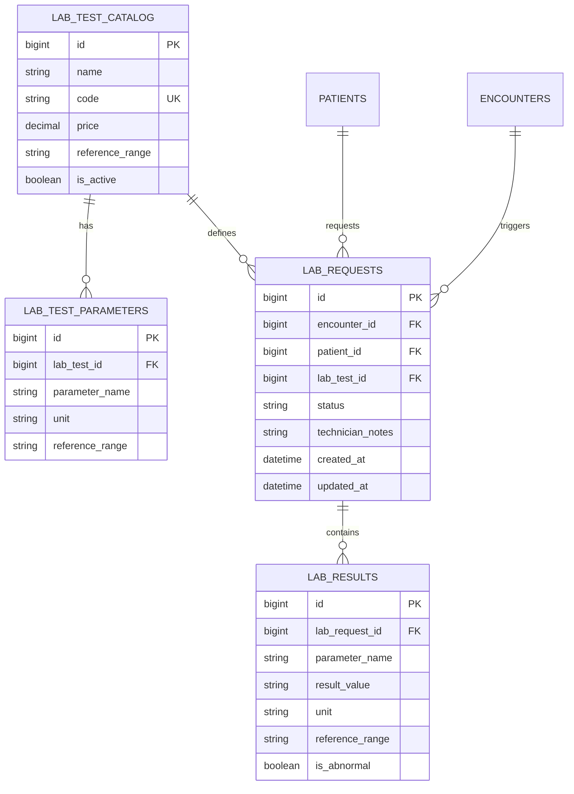

# Lab Module Database Schema

## Overview
The database design focuses on data integrity, auditability, and efficient querying for queue management.

## Entity Relationship Diagram (ERD)

## Table Definitions

### `lab_test_catalog`
| Column | Type | Constraints | Description |
|--------|------|-------------|-------------|
| `id` | BIGINT | PK, AUTO_INC | Unique identifier |
| `name` | VARCHAR | NOT NULL | Human-readable test name |
| `code` | VARCHAR | UNIQUE | Short code (e.g., CBC) |
| `price` | DECIMAL | NOT NULL | Cost of the test |
| `is_active` | BOOLEAN | DEFAULT TRUE | Soft delete flag |

### `lab_test_parameters`
| Column | Type | Constraints | Description |
|--------|------|-------------|-------------|
| `id` | BIGINT | PK, AUTO_INC | Unique identifier |
| `lab_test_id` | BIGINT | FK | Parameters belong to a catalog test |
| `parameter_name` | VARCHAR | NOT NULL | e.g., "Hemoglobin" |
| `unit` | VARCHAR | | e.g., "g/dL" |
| `reference_range`| VARCHAR | | Default normal range |

### `lab_requests`
| Column | Type | Constraints | Description |
|--------|------|-------------|-------------|
| `id` | BIGINT | PK, AUTO_INC | Unique identifier |
| `encounter_id` | BIGINT | FK | Link to clinical encounter |
| `patient_id` | BIGINT | FK | Link to patient |
| `status` | VARCHAR | INDEX | ORDERED, SAMPLED, COMPLETED, CANCELLED |
| `technician_notes`| TEXT | | Internal notes by lab staff |

### `lab_results`
| Column | Type | Constraints | Description |
|--------|------|-------------|-------------|
| `id` | BIGINT | PK, AUTO_INC | Unique identifier |
| `lab_request_id` | BIGINT | FK | Parent request |
| `parameter_name` | VARCHAR | NOT NULL | Copied from parameter definition |
| `result_value` | VARCHAR | NOT NULL | The measured value |
| `is_abnormal` | BOOLEAN | | Flag for UI highlighting |

## Indexing Strategy
- `idx_lab_request_status`: Optimizes the "Lab Queue" view which filters by status.
- `idx_lab_request_encounter`: Optimizes fetching requests for the Consultation screen.
- `idx_lab_test_code`: Ensures fast lookups for test codes.
