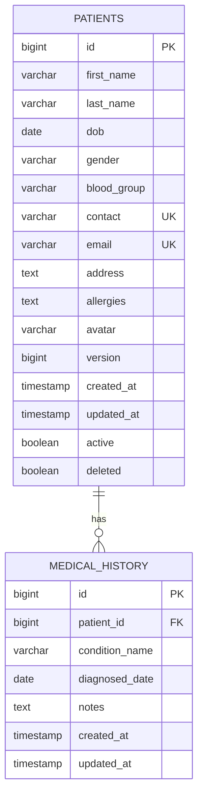

# Database Schema

This document details the database schema for the Patient module, including table structures, relationships, queries, and migration scripts.

## 1. Tables Overview

The Patient module uses two main tables:
- `patients`: Core patient information
- `medical_history`: Patient medical history records

## 2. patients Table

### Table Structure

```sql
CREATE TABLE patients (
    -- Primary Key
    id BIGINT AUTO_INCREMENT PRIMARY KEY,
    
    -- Personal Information
    first_name VARCHAR(100) NOT NULL,
    last_name VARCHAR(100) NOT NULL,
    dob DATE NOT NULL,
    gender VARCHAR(10) NOT NULL,
    blood_group VARCHAR(15),
    
    -- Contact Information
    contact VARCHAR(15) NOT NULL UNIQUE,
    email VARCHAR(100) UNIQUE,
    address TEXT,
    
    -- Medical Information
    allergies TEXT,
    avatar VARCHAR(255),
    
    -- Optimistic Locking
    version BIGINT DEFAULT 0,
    
    -- Audit Fields
    created_at TIMESTAMP DEFAULT CURRENT_TIMESTAMP,
    updated_at TIMESTAMP DEFAULT CURRENT_TIMESTAMP ON UPDATE CURRENT_TIMESTAMP,
    active BOOLEAN DEFAULT TRUE,
    deleted BOOLEAN DEFAULT FALSE,
    
    -- Indexes
    INDEX idx_patient_name (first_name, last_name),
    INDEX idx_patient_contact (contact)
) ENGINE=InnoDB DEFAULT CHARSET=utf8mb4 COLLATE=utf8mb4_unicode_ci;
```

### Field Descriptions

| Field | Type | Constraints | Description |
|-------|------|-------------|-------------|
| `id` | BIGINT | PK, AUTO_INCREMENT | Unique patient identifier |
| `first_name` | VARCHAR(100) | NOT NULL | Patient's first name |
| `last_name` | VARCHAR(100) | NOT NULL | Patient's last name |
| `dob` | DATE | NOT NULL | Date of birth |
| `gender` | VARCHAR(10) | NOT NULL | Gender (MALE, FEMALE, OTHER) |
| `blood_group` | VARCHAR(15) | NULL | Blood group (A_POSITIVE, etc.) |
| `contact` | VARCHAR(15) | NOT NULL, UNIQUE | Primary contact number |
| `email` | VARCHAR(100) | UNIQUE | Email address |
| `address` | TEXT | NULL | Full address |
| `allergies` | TEXT | NULL | Known allergies |
| `avatar` | VARCHAR(255) | NULL | Avatar/photo URL |
| `version` | BIGINT | DEFAULT 0 | Optimistic locking version |
| `created_at` | TIMESTAMP | DEFAULT NOW | Creation timestamp |
| `updated_at` | TIMESTAMP | AUTO UPDATE | Last update timestamp |
| `active` | BOOLEAN | DEFAULT TRUE | Active status |
| `deleted` | BOOLEAN | DEFAULT FALSE | Soft delete flag |

### Indexes

1. **idx_patient_name**: Composite index on (first_name, last_name)
   - Purpose: Fast name-based searches
   - Used by: Search queries filtering by name

2. **idx_patient_contact**: Index on contact
   - Purpose: Fast contact number lookups
   - Used by: Duplicate detection, search queries

### Constraints

1. **UNIQUE (contact)**: No two patients can have the same contact number
2. **UNIQUE (email)**: No two patients can have the same email (if provided)

---

## 3. medical_history Table

### Table Structure

```sql
CREATE TABLE medical_history (
    id BIGINT AUTO_INCREMENT PRIMARY KEY,
    patient_id BIGINT NOT NULL,
    condition_name VARCHAR(255),
    diagnosed_date DATE,
    notes TEXT,
    created_at TIMESTAMP DEFAULT CURRENT_TIMESTAMP,
    updated_at TIMESTAMP DEFAULT CURRENT_TIMESTAMP ON UPDATE CURRENT_TIMESTAMP,
    
    FOREIGN KEY (patient_id) REFERENCES patients(id) ON DELETE CASCADE,
    INDEX idx_medical_history_patient (patient_id)
) ENGINE=InnoDB DEFAULT CHARSET=utf8mb4 COLLATE=utf8mb4_unicode_ci;
```

### Relationships

- **Many-to-One**: medical_history → patients
- **Cascade Delete**: When patient is deleted, all medical history records are deleted

---

## 4. Entity Relationships



---

## 5. Migration Scripts

### V4__create_patient_module.sql

```sql
-- Create patients table
CREATE TABLE IF NOT EXISTS patients (
    id BIGINT AUTO_INCREMENT PRIMARY KEY,
    first_name VARCHAR(100) NOT NULL,
    last_name VARCHAR(100) NOT NULL,
    dob DATE NOT NULL,
    gender VARCHAR(10) NOT NULL,
    blood_group VARCHAR(15),
    contact VARCHAR(15) NOT NULL UNIQUE,
    email VARCHAR(100) UNIQUE,
    address TEXT,
    allergies TEXT,
    avatar VARCHAR(255),
    version BIGINT DEFAULT 0,
    created_at TIMESTAMP DEFAULT CURRENT_TIMESTAMP,
    updated_at TIMESTAMP DEFAULT CURRENT_TIMESTAMP ON UPDATE CURRENT_TIMESTAMP,
    active BOOLEAN DEFAULT TRUE,
    deleted BOOLEAN DEFAULT FALSE,
    
    INDEX idx_patient_name (first_name, last_name),
    INDEX idx_patient_contact (contact)
) ENGINE=InnoDB DEFAULT CHARSET=utf8mb4 COLLATE=utf8mb4_unicode_ci;

-- Create medical_history table
CREATE TABLE IF NOT EXISTS medical_history (
    id BIGINT AUTO_INCREMENT PRIMARY KEY,
    patient_id BIGINT NOT NULL,
    condition_name VARCHAR(255),
    diagnosed_date DATE,
    notes TEXT,
    created_at TIMESTAMP DEFAULT CURRENT_TIMESTAMP,
    updated_at TIMESTAMP DEFAULT CURRENT_TIMESTAMP ON UPDATE CURRENT_TIMESTAMP,
    
    FOREIGN KEY (patient_id) REFERENCES patients(id) ON DELETE CASCADE,
    INDEX idx_medical_history_patient (patient_id)
) ENGINE=InnoDB DEFAULT CHARSET=utf8mb4 COLLATE=utf8mb4_unicode_ci;
```

---

## 6. Common SQL Queries

### Insert Patient

```sql
INSERT INTO patients (
    first_name, last_name, dob, gender, blood_group,
    contact, email, address, allergies, avatar
) VALUES (
    'John', 'Doe', '1990-05-15', 'MALE', 'O_POSITIVE',
    '9876543210', 'john.doe@example.com', '123 Main St', 'Penicillin', NULL
);
```

### Search Patients by Name

```sql
SELECT * FROM patients
WHERE (LOWER(first_name) LIKE '%john%' 
    OR LOWER(last_name) LIKE '%john%')
  AND deleted = FALSE
ORDER BY created_at DESC
LIMIT 10 OFFSET 0;
```

### Find Patient by Contact

```sql
SELECT * FROM patients
WHERE contact = '9876543210'
  AND deleted = FALSE;
```

### Check for Duplicate

```sql
SELECT * FROM patients
WHERE first_name = 'John'
  AND last_name = 'Doe'
  AND dob = '1990-05-15'
  AND contact = '9876543210';
```

### Get Patient with Medical History

```sql
SELECT 
    p.*,
    mh.id as history_id,
    mh.condition_name,
    mh.diagnosed_date,
    mh.notes
FROM patients p
LEFT JOIN medical_history mh ON p.id = mh.patient_id
WHERE p.id = 1
  AND p.deleted = FALSE;
```

### Update Patient

```sql
UPDATE patients
SET first_name = 'John',
    last_name = 'Doe',
    email = 'john.updated@example.com',
    address = '456 New St',
    updated_at = CURRENT_TIMESTAMP,
    version = version + 1
WHERE id = 1
  AND version = 0;  -- Optimistic locking check
```

### Soft Delete Patient

```sql
UPDATE patients
SET deleted = TRUE,
    active = FALSE,
    updated_at = CURRENT_TIMESTAMP
WHERE id = 1;
```

### Count Active Patients

```sql
SELECT COUNT(*) FROM patients
WHERE active = TRUE AND deleted = FALSE;
```

---

## 7. JPA/Hibernate Queries

### Repository Methods

```java
public interface PatientRepository extends JpaRepository<Patient, Long>, 
                                           JpaSpecificationExecutor<Patient> {
    
    // Find by contact
    Optional<Patient> findByContact(String contact);
    
    // Find by email
    Optional<Patient> findByEmail(String email);
    
    // Check contact exists
    boolean existsByContact(String contact);
    
    // Check email exists
    boolean existsByEmail(String email);
    
    // Custom JPQL query for duplicate detection
    @Query("SELECT p FROM Patient p WHERE p.firstName = :firstName " +
           "AND p.lastName = :lastName AND p.dob = :dob AND p.contact = :contact")
    Optional<Patient> findPotentialDuplicate(
        @Param("firstName") String firstName,
        @Param("lastName") String lastName,
        @Param("dob") LocalDate dob,
        @Param("contact") String contact
    );
}
```

### Specification Queries

```java
// Search specification
public static Specification<Patient> search(String query) {
    return (root, criteriaQuery, criteriaBuilder) -> {
        if (!StringUtils.hasText(query)) {
            return criteriaBuilder.conjunction();
        }
        String likePattern = "%" + query.toLowerCase() + "%";
        return criteriaBuilder.or(
            criteriaBuilder.like(criteriaBuilder.lower(root.get("firstName")), likePattern),
            criteriaBuilder.like(criteriaBuilder.lower(root.get("lastName")), likePattern),
            criteriaBuilder.like(criteriaBuilder.lower(root.get("contact")), likePattern),
            criteriaBuilder.like(criteriaBuilder.lower(root.get("email")), likePattern)
        );
    };
}
```

---

## 8. Performance Considerations

### Index Strategy

1. **Composite Index (first_name, last_name)**:
   - Optimizes name-based searches
   - Supports queries filtering by first_name alone
   - Supports queries filtering by first_name + last_name

2. **Single Index (contact)**:
   - Optimizes contact lookups
   - Supports duplicate detection
   - Enforces uniqueness constraint

### Query Optimization Tips

1. **Use indexed fields in WHERE clauses**:
   ```sql
   -- GOOD: Uses index
   WHERE contact = '9876543210'
   
   -- GOOD: Uses composite index
   WHERE first_name = 'John' AND last_name = 'Doe'
   
   -- CAUTION: May not use index
   WHERE LOWER(email) LIKE '%example%'
   ```

2. **Limit result sets**:
   ```sql
   -- Always use LIMIT for large datasets
   SELECT * FROM patients LIMIT 20 OFFSET 0;
   ```

3. **Avoid SELECT ***:
   ```sql
   -- BETTER: Select only needed columns
   SELECT id, first_name, last_name, contact FROM patients;
   ```

4. **Use covering indexes when possible**:
   ```sql
   -- This query can be satisfied by idx_patient_name alone
   SELECT first_name, last_name FROM patients
   WHERE first_name = 'John';
   ```

### Optimistic Locking

The `version` field prevents lost updates:

```java
// Hibernate automatically checks version
Patient patient = patientRepository.findById(id).orElseThrow();
patient.setEmail("new@example.com");
patientRepository.save(patient);
// If version changed, throws OptimisticLockException
```

---

## 9. Data Integrity

### Referential Integrity

- `medical_history.patient_id` → `patients.id` with CASCADE DELETE
- When a patient is deleted, all medical history records are automatically deleted

### Soft Delete Strategy

- `deleted` flag prevents accidental data loss
- Deleted patients remain in database for audit purposes
- Queries should filter `deleted = FALSE` for active records

### Audit Trail

- `created_at`: Automatically set on insert
- `updated_at`: Automatically updated on every modification
- Provides complete audit trail of changes

---

## 10. Sample Data

### Insert Sample Patients

```sql
INSERT INTO patients (first_name, last_name, dob, gender, blood_group, contact, email, address, allergies) VALUES
('John', 'Doe', '1990-05-15', 'MALE', 'O_POSITIVE', '9876543210', 'john.doe@example.com', '123 Main St', 'Penicillin'),
('Jane', 'Smith', '1985-08-22', 'FEMALE', 'A_POSITIVE', '9876543211', 'jane.smith@example.com', '456 Oak Ave', NULL),
('Robert', 'Johnson', '1978-12-10', 'MALE', 'B_NEGATIVE', '9876543212', 'robert.j@example.com', '789 Pine Rd', 'Peanuts'),
('Emily', 'Davis', '1995-03-30', 'FEMALE', 'AB_POSITIVE', '9876543213', 'emily.d@example.com', '321 Elm St', 'Shellfish');
```

---

## 11. Related Documentation

- [Patient Module Overview](./01_PATIENT_MODULE_OVERVIEW.md)
- [Patient Service & Endpoints](./02_PATIENT_SERVICE_AND_ENDPOINTS.md)
- [Search & Filtering](./03_SEARCH_AND_FILTERING.md)
- [Database Migration Guide](../DATABASE_MIGRATION_GUIDE.md)
- [Database Best Practices](../database_best_practices.md)
