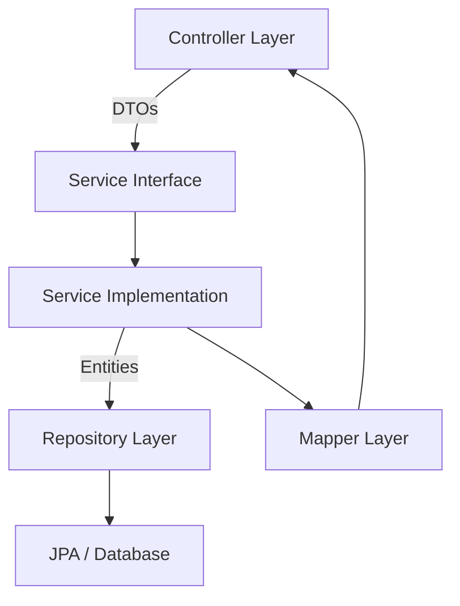
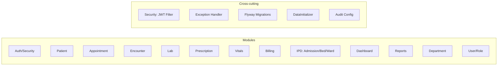

# HMS Backend — Slice Architecture Analysis

## How Slices Work

The project follows a **classic Spring Boot layered (horizontal slice) architecture** with each domain module "sliced" across these layers:

**Each domain module should ideally have:**

| Layer | Role |
|---|---|
| **Entity** | JPA entity mapped to a database table |
| **Repository** | Spring Data JPA interface for DB operations |
| **Service Interface** | Contracts defining business logic |
| **Service Impl** | Business logic implementation |
| **Controller** | REST API endpoints |
| **Request DTO** | Input validation & data transfer |
| **Response DTO** | Output shaping for the API |
| **Mapper** | Entity ↔ DTO conversion |
| **Enum** | Status/type constants |

---

## Slice Coverage Matrix

The table below maps entities to the layers they touch. **✅ = exists, ❌ = missing, ➖ = not applicable**

| Domain | Entity | Repo | Service | Impl | Controller | Req DTO | Resp DTO | Mapper | Enum |
|---|---|---|---|---|---|---|---|---|---|
| **Patient** | ✅ | ✅ | ✅ | ✅ | ✅ | ✅ | ✅ | ✅ | ➖ |
| **Appointment** | ✅ | ✅ | ✅ | ✅ | ✅ | ✅ | ✅ | ❌ | ✅ |
| **Encounter** | ✅ | ✅ | ✅ | ✅ | ✅ | ✅ | ✅ | ✅ | ✅ |
| **Admission** | ✅ | ✅ | ✅ | ✅ | ✅ | ✅ | ✅ | ✅ (IpdMapper) | ✅ |
| **Bed** | ✅ | ✅ | ✅ | ✅ | ✅ | ✅ | ✅ | ✅ (IpdMapper) | ✅ |
| **Ward** | ✅ | ✅ | ✅ | ✅ | ✅ | ✅ | ✅ | ✅ (IpdMapper) | ✅ |
| **Lab (Request)** | ✅ | ✅ | ✅ | ✅ | ✅ | ✅ | ✅ | ❌ | ✅ |
| **Lab (Result)** | ✅ | ✅ | (via LabService) | (via LabServiceImpl) | (via LabController) | ✅ | ✅ | ❌ | ➖ |
| **Lab (Catalog)** | ✅ | ✅ | (via LabService) | (via LabServiceImpl) | (via LabController) | ✅ | ❌ | ❌ | ➖ |
| **Lab (Parameter)** | ✅ | ❌ | ❌ | ❌ | ❌ | ❌ | ✅ | ❌ | ➖ |
| **Prescription** | ✅ | ✅ | ✅ | ✅ | ✅ | ✅ | ✅ | ❌ | ✅ |
| **PrescriptionItem** | ✅ | ❌ | ❌ | ❌ | ❌ | ✅ | ✅ | ❌ | ➖ |
| **Vitals** | ✅ | ✅ | ✅ | ✅ | ✅ | ✅ | ✅ | ❌ | ➖ |
| **Billing (Invoice)** | ✅ | ✅ | ✅ | ✅ | ✅ | ✅ | ✅ | ✅ | ✅ |
| **InvoiceItem** | ✅ | ✅ | (via BillingService) | (via BillingServiceImpl) | ❌ | ✅ | ✅ | ✅ | ➖ |
| **Charge** | ✅ | ✅ | (via BillingService) | (via BillingServiceImpl) | ❌ | ❌ | ❌ | ❌ | ✅ |
| **ChargeCatalog** | ✅ | ✅ | ✅ | ✅ | ✅ | ✅ | ✅ | ✅ | ✅ |
| **Payment** | ✅ | ✅ | (via BillingService) | (via BillingServiceImpl) | (via BillingController) | ✅ | ✅ | ✅ | ✅ |
| **Department** | ✅ | ✅ | ✅ | ✅ | ✅ | ❌ | ✅ | ❌ | ➖ |
| **User** | ✅ | ✅ | ✅ | ✅ | ✅ | ✅ | ✅ | ❌ | ➖ |
| **Role** | ✅ | ✅ | ✅ | ✅ | ✅ | ❌ | ✅ | ❌ | ➖ |
| **Permission** | ✅ | ✅ | ❌ | ❌ | ❌ | ❌ | ✅ | ❌ | ➖ |
| **MedicalHistory** | ✅ | ❌ | ❌ | ❌ | ❌ | ❌ | ✅ | ❌ | ➖ |
| **Round** | ✅ | ✅ | (via EncounterService) | (via EncounterServiceImpl) | (via EncounterController) | ✅ | ✅ | ❌ | ➖ |
| **RefreshToken** | ✅ | ✅ | (via AuthService) | (via AuthServiceImpl) | (via AuthController) | ✅ | ❌ | ❌ | ➖ |
| **Dashboard** | ➖ | ➖ | ✅ | ✅ | ✅ | ➖ | ✅ | ➖ | ➖ |
| **Report** | ➖ | ➖ | ✅ | ✅ | ❌ | ➖ | ➖ | ➖ | ➖ |

---

## Key Gaps & What Needs to Be Added

### 🔴 Critical (Missing Core Slices)

| Gap | Impact | Recommendation |
|---|---|---|
| **[ReportService](file:///home/artem/test/hms-final/hms-backend/src/main/java/com/hms/HospitalManagementSystem/service/ReportService.java#3-8) has no `ReportController`** | PDF generation (invoices, lab reports) cannot be accessed via REST | Add `ReportController` with endpoints like `GET /api/v1/reports/invoice/{id}/pdf` and `GET /api/v1/reports/lab/{id}/pdf` |
| **[MedicalHistory](file:///home/artem/test/hms-final/hms-backend/src/main/java/com/hms/HospitalManagementSystem/entity/MedicalHistory.java#9-32) — no Repository, Service, or Controller** | Entity exists but is completely inaccessible via API | Add `MedicalHistoryRepository`, `MedicalHistoryService`, and `MedicalHistoryController` for CRUD operations |
| **`Permission` — no Service or Controller** | Permissions can only be managed via DB; no API for CRUD | Add `PermissionService` and `PermissionController` (or include in `RoleController`) |
| **[LabTestParameter](file:///home/artem/test/hms-final/hms-backend/src/main/java/com/hms/HospitalManagementSystem/entity/LabTestParameter.java#6-33) — no Repository or Service** | Parameters are referenced by `LabTestCatalog` but have no dedicated CRUD | Add `LabTestParameterRepository`; consider CRUD endpoints or manage through `LabTestCatalog` |

### 🟡 Moderate (Missing Mappers)

Many slices use **inline entity-to-DTO mapping** inside service implementations instead of dedicated mappers. This violates separation of concerns.

| Missing Mapper | Currently Mapped In |
|---|---|
| `AppointmentMapper` | `AppointmentController` (inline) |
| `LabMapper` | `LabController` / `LabServiceImpl` (inline) |
| `VitalsMapper` | `VitalsController` (inline) |
| `PrescriptionMapper` | `PrescriptionController` (inline) |
| `UserMapper` | `UserServiceImpl` (inline) |
| `RoleMapper` | `RoleServiceImpl` (inline) |
| `DepartmentMapper` | `DepartmentServiceImpl` (inline) |
| `RoundMapper` | [EncounterServiceImpl](file:///home/artem/test/hms-final/hms-backend/src/main/java/com/hms/HospitalManagementSystem/service/impl/EncounterServiceImpl.java#29-262) (inline) |

> [!TIP]
> Consider creating a centralized `mapper` package with MapStruct or manual mappers for consistency.

### 🟡 Moderate (Missing Request DTOs)

| Domain | Issue |
|---|---|
| **Department** | No `DepartmentRequest` DTO — likely accepts entity directly |
| **Role** | No `RoleRequest` DTO — same concern |

### 🟠 Test Coverage Gaps

Only **7 test files** exist, covering just **4 modules**:

| Test File | What It Covers |
|---|---|
| `HospitalManagementSystemApplicationTests` | Context load |
| `ManualJwtTest` | JWT manual test |
| `PatientControllerIntegrationTest` | Patient controller |
| `AdmissionServiceTest` | Admission service |
| `AppointmentServiceTest` | Appointment service |
| `EncounterServiceTest` | Encounter service |
| `ReportServiceTest` | Report service |

**Missing test coverage for:**
- [BillingService](file:///home/artem/test/hms-final/hms-backend/src/main/java/com/hms/HospitalManagementSystem/service/BillingService.java#12-27) / `BillingController`
- `LabService` / `LabController`
- [PrescriptionService](file:///home/artem/test/hms-final/hms-backend/src/main/java/com/hms/HospitalManagementSystem/service/PrescriptionService.java#8-13)
- [VitalsService](file:///home/artem/test/hms-final/hms-backend/src/main/java/com/hms/HospitalManagementSystem/service/VitalsService.java#5-10)
- [DashboardService](file:///home/artem/test/hms-final/hms-backend/src/main/java/com/hms/HospitalManagementSystem/service/DashboardService.java#8-13)
- `UserService` / `AuthService`
- `PatientService` (only controller integration test exists)
- `DepartmentService`, `WardService`, `BedService`
- `ChargeCatalogService`
- All mapper classes

### 🟢 Minor / Nice-to-Have

| Gap | Recommendation |
|---|---|
| No `PrescriptionItem` repository | Items are cascade-managed via [Prescription](file:///home/artem/test/hms-final/hms-backend/src/main/java/com/hms/HospitalManagementSystem/service/PrescriptionService.java#9-10) — acceptable, but limits queries |
| No `LabTestCatalog` response DTO | Consider adding `LabTestCatalogResponse.java` for API responses |
| `Charge` entity has no direct CRUD API | Charges are created via billing flow — add read-only endpoints for transparency |
| Missing `specification` usage | Only 1 specification exists; consider adding for Appointment/Patient search/filter queries |
| No pagination support visible | Services return `List<>` — consider `Page<>` for large datasets |
| No `@Valid` annotations on some DTOs | Input validation may be inconsistent across controllers |
| No audit trail service | The `AuditConfig` exists but there's no dedicated audit query API |

---

## Architecture Summary

The project has **13 functional modules** with **5 cross-cutting concerns**. The architecture is well-structured overall, but several modules are incomplete in their slice coverage as detailed above.
